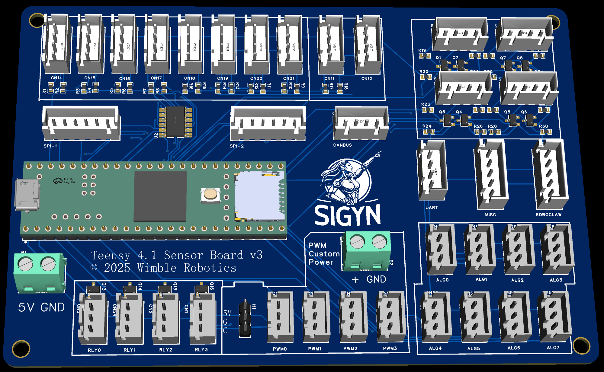

# TeensySensor v1 by WimbleRobotics

# Overview
This board is an expansion board for the Teensy 4.1 development board and was originally designed for used in the Sigyn robot by Wimble Robotics. Sigyn uses three of these boards. 
Just as an example, here is how Sigyn uses these boards as of the day of this writing.
* Board1 supports
  * 8 Time of flight sensors
  * 4 SONAR sensors
  * Communication with a RoboClaw motor driver.
  * 2 Temperature sensors.
  * Analog battery monitor.
* Board 2 supports
  * 2 BNO055 fused IMU processors.
  * 1 LIPO voltage/current monitor for the 36 volt LIPO battery.
  * 4 volate current monitors for the 24 volt, 12 volt, 5 volt and 3.3 volt DC-DC power supplies.
  * Board 3 supports
    * 2 stepper motors for the elevator and extender for the gripper assembly.
    * 4 limit switches for the stepper motors
  
The board itself has the following features:
* 8 multiplexed I2C ports.  
  This allows 8 I2C devices to have the same I2C address without conflict.
  Each port has 3K ohm pullup resistors for the SDA (data) and SCK (clock) signals.
* 2 non-multiplexed I2C ports.
* 4 level-shifted ports.  
  Each port has a pair of signals with bidirectional level shifters which translate between the 3.3V of the Teensy 4.1 and 5V for the sensor. 
  These were especially designed to support the TRIGGER/ECHO pins of the HC-SR04 SONAR sensors.
* 2 SPI ports. 
  The connectors bring out 5V, GND, MOSI, MISO, SCK and a chip select signal.
  Both ports use the same SPI channel.
* 4 PWM ports.  
  Each port provides the PWM signal, ground and power which can be selected from the 5V power port or from a custom power port, allowing you to drive servos requiring, say 7V power.
* 8 Analog ports.
* 1 CANBUS port.  
  This just brings out 3.3V, ground, receiver and transmitter signals. 
  You will need to provide extra hardware to wire it up to an external CANBUS.
  Alternatively, you can use this for any of several other purposes.
* 2 UART ports with an extra signal.  
  The extra signal can be used, for example, to provide an extra signal to the UART-driven device. On Sigyn, this signal provides an e-stop signal to the RoboClaw motor controller.
* 1 UART port without an extra signal.  
  Like most pins brought out from the Teensy 4.1, you could repurpose this pins for other uses.
* 4 level-shifted pins.  
  Each port provides 5V, GND and a bidirecton, level shifted pin which translates beteen the 3.3V of the Teensy 4.1 and 5V to drive some external device.
* A 5V external power input port.  
  You can modify the Teensy 4.1 development board by cutting a pin so that the USB input only powers the development board USB port, and all other 5V power needs can be supplied by this external input port. This gets around the limited 5V drive capability provided by the Teensy 4.1 development board itself.
* A custom, external power input port.  
  This allows you to provide a custom power rail for the PWM ports.
* A 135mm by 90mm form factor.
* 4 mounting holes with a 3.5mm opening. The centers are on a rectangle of 127 by 82mm.
* All signal connectors use the JSG XH housing standard and provide male pins on 0.1 inch (2.54mm) spacing.

# Programming The Multiplexed I2C connectors.
