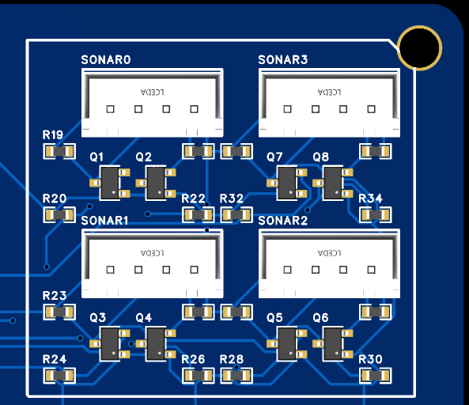

# TeensySensor v1 by WimbleRobotics


# Overview
This board is an expansion board for the Teensy 4.1 development board and was originally designed for used in the Sigyn robot by Wimble Robotics. Sigyn uses three of these boards. 
Just as an example, here is how Sigyn uses these boards as of the day of this writing.
* Board1 supports
  * 8 Time of flight sensors
  * 4 SONAR sensors
  * Communication with a RoboClaw motor driver.
  * 2 Temperature sensors.
  * Analog battery monitor.
* Board 2 supports
  * 2 BNO055 fused IMU processors.
  * 1 LIPO voltage/current monitor for the 36 volt LIPO battery.
  * 4 volate current monitors for the 24 volt, 12 volt, 5 volt and 3.3 volt DC-DC power supplies.
  * Board 3 supports
    * 2 stepper motors for the elevator and extender for the gripper assembly.
    * 4 limit switches for the stepper motors
  
The board itself has the following features:
* 8 multiplexed I2C ports.  
  This allows 8 I2C devices to have the same I2C address without conflict.
  Each port has 3K ohm pullup resistors for the SDA (data) and SCK (clock) signals.
* 2 non-multiplexed I2C ports.
* 4 level-shifted ports.  
  Each port has a pair of signals with bidirectional level shifters which translate between the 3.3V of the Teensy 4.1 and 5V for the sensor. 
  These were especially designed to support the TRIGGER/ECHO pins of the HC-SR04 SONAR sensors.
* 2 SPI ports. 
  The connectors bring out 5V, GND, MOSI, MISO, SCK and a chip select signal.
  Both ports use the same SPI channel.
* 4 PWM ports.  
  Each port provides the PWM signal, ground and power which can be selected from the 5V power port or from a custom power port, allowing you to drive servos requiring, say 7V power.
* 8 Analog ports.
* 1 CANBUS port.  
  This just brings out 3.3V, ground, receiver and transmitter signals. 
  You will need to provide extra hardware to wire it up to an external CANBUS.
  Alternatively, you can use this for any of several other purposes.
* 2 UART ports with an extra signal.  
  The extra signal can be used, for example, to provide an extra signal to the UART-driven device. On Sigyn, this signal provides an e-stop signal to the RoboClaw motor controller.
* 1 UART port without an extra signal.  
  Like most pins brought out from the Teensy 4.1, you could repurpose this pins for other uses.
* 4 level-shifted pins.  
  Each port provides 5V, GND and a bidirecton, level shifted pin which translates beteen the 3.3V of the Teensy 4.1 and 5V to drive some external device.
* A 5V external power input port.  
  You can modify the Teensy 4.1 development board by cutting a pin so that the USB input only powers the development board USB port, and all other 5V power needs can be supplied by this external input port. This gets around the limited 5V drive capability provided by the Teensy 4.1 development board itself.
* A custom, external power input port.  
  This allows you to provide a custom power rail for the PWM ports.
* A 135mm by 90mm form factor.
* 4 mounting holes with a 3.5mm opening. The centers are on a rectangle of 127 by 82mm.
* All signal connectors use the JSG XH housing standard and provide male pins on 0.1 inch (2.54mm) spacing.

# Programming The Multiplexed I2C connectors.


To use I2C devices connected to one of the 8 multiplexed connectors, you have to enable the multiplexer chip and then select which multiplexed connector to enable. `mI2C-0` is selected by passing `0` to the `selectSensorChannel` function and `mI2C-7` is selected by passing `7`. Here is some sample code:

```code
#include <Arduino.h>
#include <Wire.h>

#include <cstdint>

// Hardware configuration constants
constexpr uint8_t I2C_MULTIPLEXER_ADDRESS = 0x70;
constexpr uint8_t I2C_MULTIPLEXER_ENABLE_PIN = 8;
constexpr uint32_t I2C_CLOCK_FREQUENCY = 400000;

void setup() {
  // Do other setup here...
  Serial.begin(115200);
  while (!Serial) {
    ;  // Wait for serial port to connect. Needed for native USB port only
  }

  // Initialize I2C communication
  pinMode(I2C_MULTIPLEXER_ENABLE_PIN, OUTPUT);
  digitalWrite(I2C_MULTIPLEXER_ENABLE_PIN, HIGH);
  Wire.begin();
  Wire.setClock(I2C_CLOCK_FREQUENCY);

  // Test I2C multiplexer
  bool multiplexer_available_ = testMultiplexer();
  if (!multiplexer_available_) {
    Serial.println("I2C multiplexer not found");
    return;
  }
}

void loop() {
  // Example usage of the multiplexer
  uint8_t sensor_index =
      0;  // A number in [0..7] selecting the sensor channel (connector).
  selectSensorChannel(sensor_index);
  // Read data from the selected sensor channel
  // Insert your I2C read/write code here
}

void selectSensorChannel(uint8_t sensor_index) {
  Wire.beginTransmission(
      I2C_MULTIPLEXER_ADDRESS);   // I2C_MULTIPLEXER_ADDRESS, adjust as needed
  Wire.write(1 << sensor_index);  // Select channel
  Wire.endTransmission();
  delayMicroseconds(100);
}

bool testMultiplexer() {
  Wire.beginTransmission(I2C_MULTIPLEXER_ADDRESS);
  uint8_t error = Wire.endTransmission();

  if (error == 0) {
    String msg = "I2C multiplexer found at address 0x" +
                 String(I2C_MULTIPLEXER_ADDRESS, HEX);
    Serial.println(msg.c_str());
    return true;
  } else {
    String msg = "I2C multiplexer not found at address 0x" +
                 String(I2C_MULTIPLEXER_ADDRESS, HEX) +
                 ", error: " + String(error);
    Serial.println(msg.c_str());
    return false;
  }
}
```

# Programming the 4 SONAR connectors.


The four connectors are hardware designed to translate between the 5 voltes needed for HC-SR04 Ping sensors and the 3.3 volts used by the Teensy 4.1.
You can probably use any Arduino library that supports the HC-SR04, knowing the pin numbers for the TRIGGER and ECHO signals for each sensor.

```code
    // GPIO pins for controlling the sonar sensors
    static const uint8_t PIN_ECHO0 = 25;
    static const uint8_t PIN_TRIGGER0 = 24;
    static const uint8_t PIN_ECHO1 = 27;
    static const uint8_t PIN_TRIGGER1 = 26;
    static const uint8_t PIN_ECHO2 = 29;
    static const uint8_t PIN_TRIGGER2 = 28;
    static const uint8_t PIN_ECHO3 = 37;
    static const uint8_t PIN_TRIGGER3 = 36;
```

If you'd like to see a more sophisticated approach, in my github archive at 
 in the `tsonar.h` and `tsonar.cpp` files, you can see a way of using a timer and a state machine to space out the handling of 4 SONAR sensor to minimize the interference with each other and to use interrupt handlers so that you don't have to waste time polling the sensors to get the distance results.

# Programming the 8 Analog connectors.


The 8 analog inputs correspond to pins 24 through 27 for ALG0 through ALG3 and pings 38 through 41 for ALG4 through ALG7.

A code snippet to read the voltage on the ALG1 connector is:

```code
void setup() {
   analogReadResolution(10);
   pinMode(25, INPUT);
}

void loop() {
  int16_t raw_value = analogRead(25);
}
```