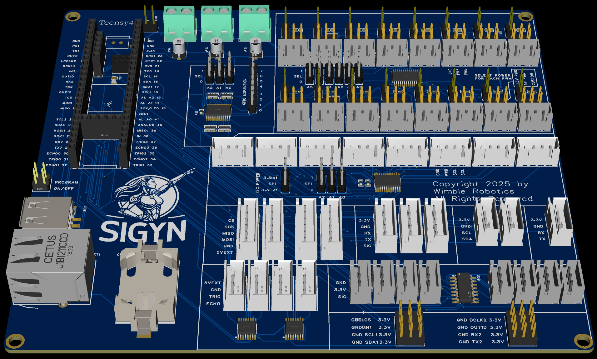

# TeensySensorV4 v1 by WimbleRobotics

# Overview
This board is an expansion board for the Teensy 4.1 development board and was originally designed for use in the Sigyn robot by Wimble Robotics.

The board has the following features:
* 8 multiplexed I2C ports.  
  * This allows 8 I2C devices to have the same I2C address without conflict.
  * Each port has 3K ohm pullup resistors for the SDA (data) and SCK (clock) signals.
  * The multiplexor chip has 3 address-select jumpers to allow moving the base I2C address.
  * The 3.3 volt rail can be selected to be powered by the 3.3 volt rail from the Teensy 4.1 chip or from the external 3.3 volt connector, allowing driving of higher power I2C devices.
  * The multiplexer reset signal is programmable.
* 2 non-multiplexed I2C ports.
* 4 level-shifted ports.  
  * There are a pair of TXB0106 chips, each of which provides a pair of level-shifted, bidirectional signals.
  * Each output signal is level-shifted to the 5V external power port.
  * These were especially designed to support the TRIGGER/ECHO pins of the HC-SR04 SONAR sensors but can be used for any bidirectional, level-shifted need.
* 4 SPI ports. 
  * The connectors bring out 5V, GND, MOSI, MISO, SCK and a chip select signal.
  * There are two SPI channels used from the Teensy 4.1, each channel is expanded to a pair of connectors. This allows, e.g., setting different clock frequencies to the two channels.
* 16 PWM ports.  
  * Each port provides the PWM signal, ground and power which can be selected from the 5V power port, the 3.3v power port or from a custom power port, allowing you to drive servos requiring, say 7V power.
  * Each port has a jumper allowing you to enable an onboard LED which makes it easy to monitor the signal or use the port as a programmable LED display.
  * The 16 channels are driven by a PCA 9685 multiplexer chip with 5 address-select jumpers to allow moving the base I2C address.
  * Each port has in in-line 220 ohm resistor for the PWM signal.
  * The multiplexer output enable signal is programmable. 
* 8 Multiplexed analog ports.
  * A CD74HC4051 multiplexer chip is used.
  * The analog enable signal to the multiplexer is programmable.
* 1 CANBUS port.  
  This just brings out 3.3V, ground, receiver and transmitter signals. 
  You will need to provide extra hardware to wire it up to an external CANBUS.
  Alternatively, you can use this for any of several other purposes.
* 3 UART ports with an extra signal.  
  The extra signal can be used, for example, to provide an extra signal to the UART-driven device. On my robot, this signal provides an e-stop signal to the RoboClaw motor controller.
* A GPIO expander chip.
  * The TCA9535 expander chip uses 8 signals for internal use and provides 8 signals brounght out for general purpose use.
  * The outputs all have 10K ohm pullup resistors.
  * The interrupt signal is available to the Teensy 4.1 so that you can tell if the input signal on any pin has changed level without having to poll each signal.
  * The multiplexer chip with 3 address-select jumpers to allow moving the base I2C address.
* The Ethernet connector is provided which will connect to the Teensy 4.1 Ethernet pins if you solder on the appropriate connector to the development board.
* A USB host connector is provided which will connect to the Teensy 4.1 USB host pins if you solder on the appropriate connector to the development board.
* A CR32032 battery holder is provided which can power the Teensy 4.1 internal real time clock.
* Jumpers are brought out for the Teensy 4.1 program and power on/off pins  which will connect to the Teensy 4.1 pins if you solder on the appropriate connector to the development board.
* A 5V external power input port.  
  You can modify the Teensy 4.1 development board by cutting a pin so that the USB input only powers the development board USB port, and all other 5V power needs can be supplied by this external input port. This gets around the limited 5V drive capability provided by the Teensy 4.1 development board itself.
* A 3.3V external power input port.
    * This especially allows to to power higher powered devices on the PWM connectors or the I2C multiplexed connectors, not relying soley on the 3.3V power rail provided by the Teensy 4.1 chip.
* A custom, external power input port.  
  This allows you to provide a custom power rail for the PWM ports.
* A 160mm by 145mm form factor.
* 4 mounting holes with a 3.5mm opening. The centers are on a rectangle of 154 by 138.5mm.
* All signal connectors use the JSG XH housing standard and provide male pins on 0.1 inch (2.54mm) spacing.
