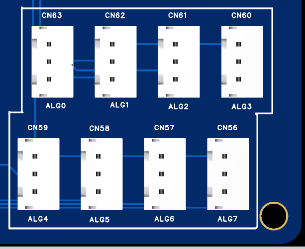
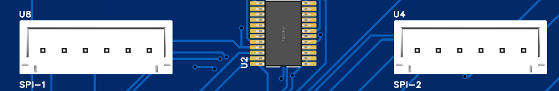
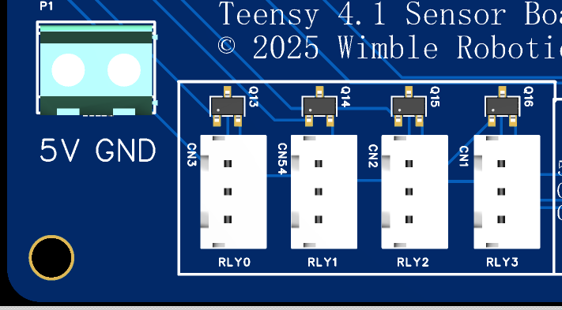
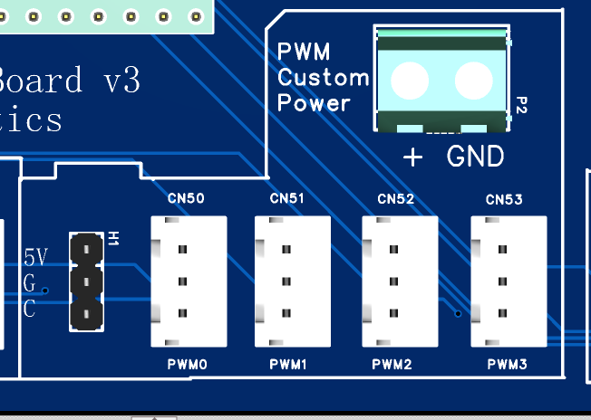
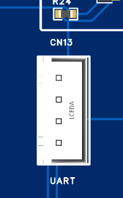
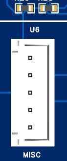
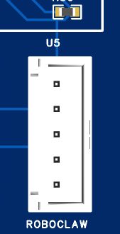

# TeensySensor v1 by WimbleRobotics


# Overview
This board is an expansion board for the Teensy 4.1 development board and was originally designed for use in the Sigyn robot by Wimble Robotics. Sigyn uses three of these boards. 
Just as an example, here is how Sigyn uses these boards as of the day of this writing.
* Board1 supports
  * 8 Time of flight sensors
  * 4 SONAR sensors
  * Communication with a RoboClaw motor driver.
  * 2 Temperature sensors.
  * Analog battery monitor.
* Board 2 supports
  * 2 BNO055 fused IMU processors.
  * 1 LIPO voltage/current monitor for the 36 volt LIPO battery.
  * 4 volate current monitors for the 24 volt, 12 volt, 5 volt and 3.3 volt DC-DC power supplies.
  * Board 3 supports
    * 2 stepper motors for the elevator and extender for the gripper assembly.
    * 4 limit switches for the stepper motors
  
The board itself has the following features:
* 8 multiplexed I2C ports.  
  This allows 8 I2C devices to have the same I2C address without conflict.
  Each port has 3K ohm pullup resistors for the SDA (data) and SCK (clock) signals.
* 2 non-multiplexed I2C ports.
* 4 level-shifted ports.  
  Each port has a pair of signals with bidirectional level shifters which translate between the 3.3V of the Teensy 4.1 and 5V for the sensor. 
  These were especially designed to support the TRIGGER/ECHO pins of the HC-SR04 SONAR sensors.
* 2 SPI ports. 
  The connectors bring out 5V, GND, MOSI, MISO, SCK and a chip select signal.
  Both ports use the same SPI channel.
* 4 PWM ports.  
  Each port provides the PWM signal, ground and power which can be selected from the 5V power port or from a custom power port, allowing you to drive servos requiring, say 7V power.
* 8 Analog ports.
* 1 CANBUS port.  
  This just brings out 3.3V, ground, receiver and transmitter signals. 
  You will need to provide extra hardware to wire it up to an external CANBUS.
  Alternatively, you can use this for any of several other purposes.
* 2 UART ports with an extra signal.  
  The extra signal can be used, for example, to provide an extra signal to the UART-driven device. On Sigyn, this signal provides an e-stop signal to the RoboClaw motor controller.
* 1 UART port without an extra signal.  
  Like most pins brought out from the Teensy 4.1, you could repurpose this pin for other uses.
* 4 level-shifted pins.  
  Each port provides 5V, GND and a bidirectonal, level shifted pin which translates between the 3.3V of the Teensy 4.1 and 5V to drive some external device.
* A 5V external power input port.  
  You can modify the Teensy 4.1 development board by cutting a pin so that the USB input only powers the development board USB port, and all other 5V power needs can be supplied by this external input port. This gets around the limited 5V drive capability provided by the Teensy 4.1 development board itself.
* A custom, external power input port.  
  This allows you to provide a custom power rail for the PWM ports.
* A 135mm by 90mm form factor.
* 4 mounting holes with a 3.5mm opening. The centers are on a rectangle of 127 by 82mm.
* All signal connectors use the JSG XH housing standard and provide male pins on 0.1 inch (2.54mm) spacing.

# Programming the I2C connectors.


In the picture, each of the 10 connectors has pin 1 at the top and pin 4 at the bottom. The leftmost 8 connectors are multiplexed I2C connectors and the rightmost 2 connectors are non-multiplexed.

| Connector Pin | Teensy Signal Name | Teensy Digital Pin |
| :-----------: | :----------------: | :----------------: |
|       1       |     3.3 volts      |                    |
|       2       |        GND         |                    |
|       3       |        SCL         |         19         |
|       4       |        SDA         |         18         |

Each multiplexed connector has a separate 3K ohm pullup resistor for the SCL (clock) and SDA (data) pins. The non-multiplexed connectors share whatever, if any, pullup resistors you set for the first I2C channel of the Teensy 4.1 which is what also drives the I2C multiplexer.

To use I2C devices connected to one of the 8 multiplexed connectors, you have to enable the multiplexer chip and then select which multiplexed connector to enable. Sample code below shows how to do this. `mI2C-0` is selected by passing `0` to the `selectSensorChannel` function and `mI2C-7` is selected by passing `7`. Here is some sample code:

```code
#include <Arduino.h>
#include <Wire.h>

#include <cstdint>

// Hardware configuration constants
constexpr uint8_t I2C_MULTIPLEXER_ADDRESS = 0x70;
constexpr uint8_t I2C_MULTIPLEXER_ENABLE_PIN = 8;
constexpr uint32_t I2C_CLOCK_FREQUENCY = 400000;

void setup() {
  // Do other setup here...
  Serial.begin(115200);
  while (!Serial) {
    ;  // Wait for serial port to connect. Needed for native USB port only
  }

  // Initialize I2C communication
  pinMode(I2C_MULTIPLEXER_ENABLE_PIN, OUTPUT);
  digitalWrite(I2C_MULTIPLEXER_ENABLE_PIN, HIGH);
  Wire.begin();
  Wire.setClock(I2C_CLOCK_FREQUENCY);

  // Test I2C multiplexer
  bool multiplexer_available_ = testMultiplexer();
  if (!multiplexer_available_) {
    Serial.println("I2C multiplexer not found");
    return;
  }
}

void loop() {
  // Example usage of the multiplexer
  uint8_t sensor_index =
      0;  // A number in [0..7] selecting the sensor channel (connector).
  selectSensorChannel(sensor_index);
  // Read data from the selected sensor channel
  // Insert your I2C read/write code here
}

void selectSensorChannel(uint8_t sensor_index) {
  Wire.beginTransmission(
      I2C_MULTIPLEXER_ADDRESS);   // I2C_MULTIPLEXER_ADDRESS, adjust as needed
  Wire.write(1 << sensor_index);  // Select channel
  Wire.endTransmission();
  delayMicroseconds(100);
}

bool testMultiplexer() {
  Wire.beginTransmission(I2C_MULTIPLEXER_ADDRESS);
  uint8_t error = Wire.endTransmission();

  if (error == 0) {
    String msg = "I2C multiplexer found at address 0x" +
                 String(I2C_MULTIPLEXER_ADDRESS, HEX);
    Serial.println(msg.c_str());
    return true;
  } else {
    String msg = "I2C multiplexer not found at address 0x" +
                 String(I2C_MULTIPLEXER_ADDRESS, HEX) +
                 ", error: " + String(error);
    Serial.println(msg.c_str());
    return false;
  }
}
```

Using the non-multiplexed

# Programming the 4 SONAR connectors.


In the picture, pin 1 of each connector is the leftmost pin and pin 4 is the rightmost pin. Each pin's use is:

| Connector Pin | Teensy Signal Name  | Teensy Digital Pin |
| :-----------: | :-----------------: | :----------------: |
|       1       |       5 volts       |                    |
|       2       |         GND         |                    |
|       3       | OUT1B, RX8, CS, TX3 |   24, 26, 28, 36   |
|       4       | MCKL2, TX8, CS, RX3 |   25, 27, 29, 37   |

Note that the Teensy 4.1 documents show the same logical 'CS' name for two different pins. Be sure you use the Teensy 4.1 digital pin numbers for your programming.

The four connectors are hardware designed to translate between the 5 voltes needed for HC-SR04 Ping sensors and the 3.3 volts used by the Teensy 4.1, so the TRIGGER and ECHO pins on each connector are 5 volt level signals.
You can probably use any Arduino library that supports the HC-SR04, knowing the pin numbers for the TRIGGER and ECHO signals for each sensor.

If you'd like to see a more sophisticated approach, in my GitHub archive at 
 in the `tsonar.h` and `tsonar.cpp` files, you can see a way of using a timer and a state machine to space out the handling of 4 SONAR sensors to minimize the interference with each other and to use interrupt handlers so that you don't have to waste time polling the sensors to get the distance results.

# Programming the 8 Analog connectors.



In the picture, each connector has pin 1 at the top and pin 3 at the bottom.
The signal for each pin is:

| Connector Pin |           Teensy Signal Name           |       Teensy Digital Pin       |
| :-----------: | :------------------------------------: | :----------------------------: |
|       1       |               3.3 volts                |                                |
|       2       |                  GND                   |                                |
|       3       | A10, A11, A12, A13, A14, A15, A16, A17 | 24, 25, 26, 27, 38, 39, 40, 41 |


A code snippet to read the voltage on the ALG1 connector is:

```code
void setup() {
   analogReadResolution(10);
   pinMode(25, INPUT);
}

void loop() {
  int16_t raw_value = analogRead(25);
}
```

# Programming the 2 SPI connectors.



In the picture, pin 6 is the leftmost pin for each of the two SPI connectors and pin 1 is the rightmost. The pin signals are:

| Connector Pin | Teensy Signal Name | Teensy Digital Pin |
| :-----------: | :----------------: | :----------------: |
|       1       |      5 volts       |                    |
|       2       |        GND         |                    |
|       3       |        MOSI        |         11         |
|       4       |        MISO        |         12         |
|       5       |        SCK         |      13 (LED)      |
|       6       |     OUT1C / CS     |       9 / 10       |

That is, for the SPI-1 connector, pin6, the chip select pin is the OUT1C signal, which is digital pin 9 for the Teensy 4.1. For the SPI-2 connector, pin 6 is the CS signal, which is digital pin 10.

# Programming the 4 RELAY connectors.



The 4 relay connectors have the traces connected to the wrong  pins of the MOSFET level translators, so cannot be used on this rev of the board.

# Programming the 4 PWM connectors.



In this picture, pin 1 for each connector is at the top and pin 3 is at the bottom. The pin signals are:

| Connector Pin |    Teensy Signal Name    | Teensy Digital Pin |
| :-----------: | :----------------------: | :----------------: |
|       1       |           GND            |                    |
|       2       |       Custom power       |                    |
|       3       | BCKL2, IN2, OUT1D, OUT1A |     4, 5, 6, 7     |

That is, PWM0 gets the PWM signal from the BCLK2 signal, which is digital pin 4.
Pin 2, the custom power, is set by placing a jumper on the H1 connector between the top two pins, to select the 5 volt power supply provided by either the Teensy 4.1 chip itself or the 5V supply connector P1, or place the jump between the bottom two pins to select the power from the custom power input P2.

# Programming the CANBUS connector.


In this picture, pin 1 is on the left and pin 4 is on the right.

| Connector Pin | Teensy Signal Name | Teensy Digital Pin |
| :-----------: | :----------------: | :----------------: |
|       1       |     3.3 volts      |                    |
|       2       |        GND         |                    |
|       3       |        CRX1        |         23         |
|       4       |        CTX1        |         22         |

# Programming the UART connector.



In the picture, pin 1 is at the top and pin 4 is at the bottom.

| Connector Pin | Teensy Signal Name | Teensy Digital Pin |
| :-----------: | :----------------: | :----------------: |
|       1       |     3.3 volts      |                    |
|       2       |        GND         |                    |
|       3       |        RX5         |         21         |
|       4       |        TX5         |         20         |

# Programming the MISC connector.



In the picture, pin 1 is at the top and pin 5 is at the bottom.

| Connector Pin | Teensy Signal Name | Teensy Digital Pin |
| :-----------: | :----------------: | :----------------: |
|       1       |     3.3 volts      |                    |
|       2       |        GND         |                    |
|       3       |        RX4         |         16         |
|       4       |        TX4         |         17         |
|       5       |        CTX3        |         31         |

# Programming the ROBOCLAW connector.



In the picture, pin 1 is at the top and pin 5 is at the bottom.

| Connector Pin | Teensy Signal Name | Teensy Digital Pin |
| :-----------: | :----------------: | :----------------: |
|       1       |     3.3 volts      |                    |
|       2       |        GND         |                    |
|       3       |        RX7         |         28         |
|       4       |        TX7         |         29         |
|       5       |        CRX3        |         30         |
