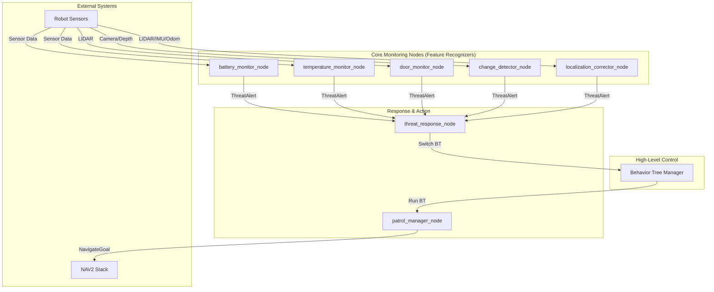

# Sigyn House Patroller Architecture Guide

This document outlines the architecture of the `sigyn_house_patroller` package, explains the purpose of each component, and provides a recommended implementation and testing workflow.

## 1. High-Level Architecture

The system is designed around a central **Behavior Tree (BT)** that dictates the robot's high-level goals. This BT is supported by a collection of specialized, independent nodes that act as "feature recognizers" or "skill servers." These nodes monitor specific subsystems, detect events, and publish standardized messages. A `ThreatResponse` node listens for these messages and can influence the BT's behavior.

This modular approach allows for incremental development and testing.

## 2. Component Breakdown & Implementation Guide

Here is the purpose of each key file and hints for filling in the logic.

### Core Logic (`src/core/`)

These are libraries, not nodes. They contain reusable business logic.

-   `patrol_manager.cpp`: **The Robot's Skill Set.** This class is the primary action server for the Behavior Tree. It doesn't decide *what* to do, but it knows *how* to do it.
    -   **To Implement:** Flesh out the action server logic. The `ExecutePatrolAction` function should take a waypoint name from the BT, find its coordinates using the `waypoint_manager_`, and send the goal to the `navigation_coordinator_`. It then needs to monitor the result and report success or failure back to the BT.
-   `waypoint_manager.cpp`: **The Robot's Mental Map.** Manages loading, storing, and retrieving waypoints from the `waypoints.yaml` file.
    -   **To Implement:** The loading logic is mostly there. Ensure the `FindWaypoint`, `GetAllWaypoints`, and `GetWaypointsForRoom` functions are robust.
-   `navigation_coordinator.cpp`: **The NAV2 Interface.** This is a clean wrapper around the `nav2_msgs/action/NavigateToPose` action client.
    -   **To Implement:** The core logic of sending a goal and handling the response (`OnNavigationComplete`) is the main task. Make sure to handle all possible result codes from Nav2 (e.g., success, failure, canceled).
-   `threat_detection_manager.cpp`: **Threat Aggregator.** A utility class that can be used to manage and prioritize incoming threats.
    -   **To Implement:** This is lower priority. Initially, the `threat_response_node` can handle threats directly. This manager becomes useful later for de-duplicating or prioritizing complex threat scenarios.

### Nodes (`src/nodes/`)

These are the executable ROS 2 nodes.

-   `patrol_coordinator_node.cpp`: **The Main Process.** This node's `main` function is responsible for instantiating all the core manager classes and spinning them up. It acts as the composition root.
    -   **Status:** Mostly complete. No major implementation needed.
-   `battery_monitor_node.cpp`: **Power Management.**
    -   **To Implement:** Subscribe to your Teensy's battery topic. Implement the logic to check if `percentage` is below the `low_level` or `critical_level` thresholds. If it is, publish a `ThreatAlert` message with an appropriate `threat_type` (e.g., "battery_low") and `severity_level`.
-   `temperature_monitor_node.cpp`: **Thermal Safety.**
    -   **To Implement:** Subscribe to your temperature sensor topics. Compare readings against the `min_temp_c` and `max_temp_c` parameters. Publish a `ThreatAlert` if thresholds are breached.
-   `door_monitor_node.cpp`: **Perimeter Security.**
    -   **To Implement:** This is more complex. In the `LaserScanCallback`, you need to get the range reading at the angle specified for each door in your config. Compare this `measured_distance` to the `expected_distance` +/- `tolerance`. If it's out of bounds, publish a `ThreatAlert`. The learning mechanism can be implemented later to auto-calibrate the expected distances.
-   `change_detector_node.cpp`: **Anomaly Detection.**
    -   **To Implement:** This is a key node for your "fallen object" requirement.
        1.  In the `ImageCallback` and `PointCloudCallback`, store the first message received as the "baseline" for a given location.
        2.  On subsequent visits to the same location (you'll need a way to know the robot's location, perhaps from the `patrol_manager`), compare the current image/pointcloud to the baseline.
        3.  For images, a simple approach is `cv::absdiff` followed by counting non-zero pixels. For point clouds, you can use PCL's octree-based change detection.
        4.  If the difference exceeds a threshold, publish a `ThreatAlert`.
-   `localization_corrector_node.cpp`: **SLAM Sanity Check.**
    -   **To Implement:** This is an advanced feature. The goal is to use your wall database to correct Nav2's pose.
        1.  Subscribe to `/scan` and `/amcl_pose`.
        2.  When you get a scan, try to match the laser returns to the walls in your database. This is a scan-matching problem.
        3.  If you find a high-confidence match that significantly disagrees with the `/amcl_pose`, you can either publish a corrected pose to `/initialpose` (to re-initialize AMCL) or publish a `ThreatAlert` indicating delocalization.
-   `threat_response_node.cpp`: **The Decision Maker.**
    -   **To Implement:** In the `ThreatAlertCallback`, implement a `switch` statement or `if/else` chain based on the `threat_type` and `severity_level`.
        -   For a "battery_critical" threat, it should call the service on the `behavior_tree_manager` to switch to the `go_charge.xml` behavior tree.
        -   For a "door_open" threat, it might switch to an `investigate_threat.xml` tree.
        -   For low-priority threats, it could just log the event or send a notification. The logic for sending an email would go here.

### Behavior Trees (`src/behavior_tree/`)

-   `behavior_tree_manager.cpp`: **The BT Conductor.** This node loads and runs the actual Behavior Tree XML files. It exposes a service to allow the `threat_response_node` to switch which BT is active.
    -   **Status:** Mostly complete. The core logic for switching and running trees is there.
-   **BT Action/Condition Nodes** (`check_battery_level.cpp`, `navigate_to_waypoint.cpp`, etc.): These are the C++ implementations of the custom nodes used in your XML files.
    -   **To Implement:** Each of these nodes needs to implement its `tick()` function.
        -   `check_battery_level`: Subscribes to the battery state and returns `SUCCESS` if the battery is above a certain threshold, `FAILURE` otherwise.
        -   `navigate_to_waypoint`: This is the most important one. It needs to be an *asynchronous* action client. When it first ticks, it should call the `patrol_to_waypoint` action on the `patrol_manager`. On subsequent ticks, it should check if the action is done. It returns `RUNNING` until the action is complete, then `SUCCESS` or `FAILURE`.

## 3. Recommended Implementation & Testing Workflow

Follow this order to bring the system up incrementally in your simulation.

1.  **Phase 1: Basic Navigation**
    -   **Goal:** Make the robot move between two waypoints using the BT.
    -   **Implement:**
        1.  `waypoint_manager.cpp`: Make sure it loads your `waypoints.yaml`.
        2.  `navigation_coordinator.cpp`: Implement the Nav2 action client.
        3.  `patrol_manager.cpp`: Implement the `patrol_to_waypoint` action server logic.
        4.  `navigate_to_waypoint.cpp` (BT Node): Implement the action client that calls the `patrol_manager`.
    -   **Test:**
        -   Launch your simulation (`sigyn.launch.py`).
        -   Launch only the `patrol_coordinator.launch.py`.
        -   Use the ROS 2 CLI to manually call the `/patrol_coordinator/patrol_to_waypoint` action and verify the robot moves.
        -   Launch the `behavior_tree_manager.launch.py` and use a simple BT that just navigates to one waypoint.

2.  **Phase 2: Basic Monitoring & Alerting**
    -   **Goal:** Have the robot detect a simple threat (e.g., low battery) and publish an alert.
    -   **Implement:**
        1.  `battery_monitor_node.cpp`: Implement the logic to publish a `ThreatAlert`.
        2.  `threat_response_node.cpp`: Implement the `ThreatAlertCallback` to simply log a message, e.g., "Threat received: [type]".
    -   **Test:**
        -   Run the nodes from Phase 1.
        -   Launch `battery_monitor.launch.py` and `threat_response.launch.py`.
        -   Use the ROS 2 CLI to publish a fake `BatteryState` message with a low percentage.
        -   Verify that the `threat_response_node` logs the correct message.

3.  **Phase 3: Reactive Behavior**
    -   **Goal:** Make the robot change its behavior in response to a threat.
    -   **Implement:**
        1.  `threat_response_node.cpp`: Enhance the callback to call the `behavior_tree_manager`'s switch service.
        2.  Create a second, simple BT (e.g., `emergency.xml`) that does something different (e.g., navigates to a "safe" waypoint).
    -   **Test:**
        -   Run all nodes from previous phases.
        -   Publish the fake `BatteryState` message again.
        -   Verify that the `behavior_tree_manager` reports it has switched trees and that the robot executes the new behavior.

4.  **Phase 4: Advanced Sensing**
    -   **Goal:** Integrate the more complex sensor nodes.
    -   **Implement & Test (one by one):**
        1.  `door_monitor_node.cpp`
        2.  `change_detector_node.cpp`
        3.  `localization_corrector_node.cpp`
    -   For each node, follow the same pattern: implement the logic, launch it, create a scenario in your simulation (e.g., remove a wall to simulate an open door), and verify that the correct `ThreatAlert` is published.

By following this phased approach, you can build and debug your complex system one manageable piece at a time.
