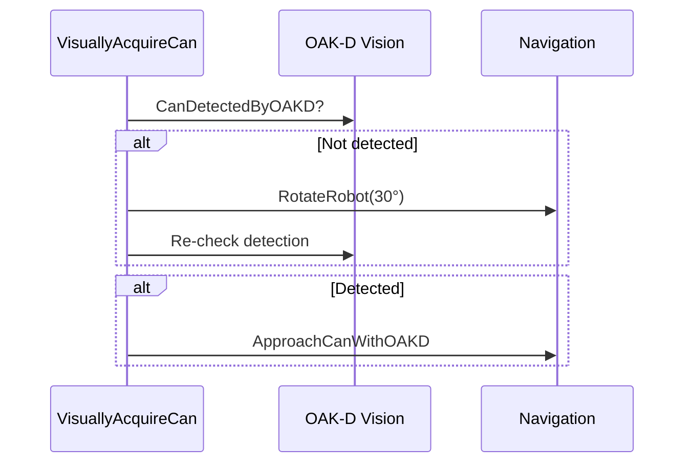
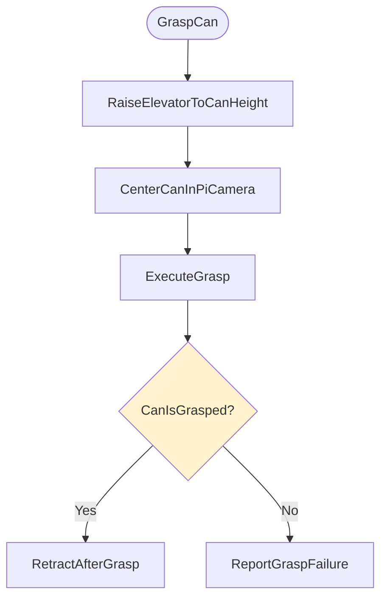

# Fetch Me a Beer: A Behavior Tree Walkthrough for ROS 2 Developers
## Copyright © 2026 By Michael Wimble. Version 1.

**Audience**: ROS 2 developers with moderate skill and basic Behavior Tree familiarity  
**BT Source**: 

This article assumes you have knowledge of the  library, 
so not a discussion is given about the various nodes in the tree work. 
This is more of a description of the architecture of the behavior tree that I developed as a first step
towards participating in the Robotics Society ​of Southern California .
The tree is not ready for prime time, it is just a proof of concept. 
Another paper discusses the work that went into crafting this tree and all the piecess needed to test this in simulation.

## Overview

The “fetch me a beer” task is a compact stress test for autonomy: the robot must navigate, perceive, manipulate, and remain safe in a dynamic environment. The behavior tree in `main.xml` solves this by **decomposing the mission into subtrees** and using **reactive control flow** to keep safety and perception live at all times.

## Big picture: the mission tree

The `Root` captures the mission flow:  
- Save the start pose.  
  Capture where I am so the beer can be returned to me. 
- Set up various variables.
- Fetch the can.  
  Explained below.
- Back away from the table.  
  Before returning to me, make sure the robot has clearance to move.
- Return to start pose.  
  Bring the beer back to me.
  


### Key point: reactive execution

The `FetchCan` node is a **ReactiveSequence**. This means **every tick re-evaluates all children**. If perception changes or safety triggers, the tree responds immediately without being “stuck” in an old action.

## Safety: always-on, always first-class

Safety is implemented as its own subtree (`ReactiveRobotSafety`) using a **ReactiveSequence** of checks:

- `RobotHasNotFallenOver`
- `RobotIsNotAboutToFallOver`
- `RobotIsNotEStopped`
- `EnsureBatteryIsNotCritical`
- `BatteryIsCharged`

Each of those uses **Inverter + ReactiveFallback** patterns to convert a bad condition into a shutdown or E-stop action. 
Well, actually each of the tests will actually be transformed into a reactive fallback node so that, say, if the robot has fallen over the whole system will shutdown after sending me an alert message, but if the robot is only about to fall over the system will signal an  emergenty stop (e-stop) to the robot and, again, send me a message. 


The safety system is just a stand-in for the moment, it's not really participating yet in the full safety system for the robot ***Sigyn*** as I described in another paper. One of the purposes of this tree was to test reactive safety.

Because `ReactiveRobotSafety` is a reactive sequence, and the whole tree is designed to be reactive, at every tick of the tree, safety will be tested and dealt with.


## Getting to that beer

Looking back at the `NavigateToCanLocation` node and its expansion, we use a reactive fallback node with a guard test to make sure that we only try to get to the can once. The `SetupCanChallenge` node set the blackboard `needToNavigate` variable to `true` and, once we have achieved the goal of getting to the can, we set `needToNavigate` to `false` so it won't be tried again. Once more, this is not behavior tree that is ready for production as that would deal with a condition, say, where we found a can of beer and then found the can was empty so we needed to go find a different can. But, for the challenge, this suffices.


## Backward chaining: goals drive prerequisites

Backward chaining shows up most clearly in navigation and approach:

- Goal: “robot is near the can”
- Prereq: “compute a feasible approach pose”
- Prereq: “navigate to that pose”

This is captured in `ApproachCanWithOAKD`:

```xml
<ReactiveFallback name="GetWithinReach">
  <Condition ID="CanWithinReach" />
  <ReactiveFallback>
    <Action ID="MoveTowardsCan" />
    <Decorator ID="ReactiveRepeatUntilSuccessOrCount" num_cycles="1000">
      <Sequence>
        <Action ID="ComputeApproachGoalToCan" />
        <Action ID="NavigateToPoseAction" />
      </Sequence>
    </Decorator>
  </ReactiveFallback>
</ReactiveFallback>
```

**Interpretation**: keep asking “are we within reach?” If not, try the cheapest action (`MoveTowardsCan`). If that fails, plan a proper navigation goal and move there. That’s backward chaining in action: the **goal is checked first**, and prerequisites are attempted only when needed.

## Task decomposition: subtrees as reusable skills

The BT uses a strong decomposition strategy:

- **Navigation skill**: `NavigateToCanLocation`
- **Visual acquisition skill**: `SearchForCanWithOAKD` + `ApproachCanWithOAKD`
- **Manipulation skill**: `GraspCan` (composed of raising, centering, executing, retracting)
- **Safety skill**: `ReactiveRobotSafety`

Each subtree has a clean contract and shared blackboard data (`__shared_blackboard="true"`). That matches Ogren’s modularity principle: **small trees are easier to test and reason about**.

## Visual acquisition: search then approach

The `VisuallyAcquireCan` subtree is a **two-phase strategy**: first find, then approach.



The `SearchForCanWithOAKD` subtree uses a **ReactiveRepeatUntilSuccessOrCount** decorator to rotate and keep checking. The `ForceFailure` wrapper ensures the fallback keeps trying until detection is found (or the rotation budget is exhausted).

## Manipulation: controlled, sensor-driven steps

The grasping sequence is deliberately **incremental**:

- Raise elevator in steps (`StepElevatorUp`), waiting for new camera frames
- Center the can in the Pi camera view
- Extend, close gripper, lift slightly
- Verify the can is grasped

This is a classic **sense–act–sense** loop, the kind of feedback cycle Ogren recommends when dealing with uncertain perception and mechanical variability.



## One-time work with flags (avoid redoing expensive tasks)

The tree uses boolean flags on the blackboard:

- `needToNavigate`
- `needToVisuallyAcquire`
- `needToGrasp`

Each major subtree begins with:

```xml
<Condition ID="CheckBoolFlag" expected="false" flag="{needToNavigate}" />
```

If the task is already complete, the subtree exits quickly. If not, it performs the work and flips the flag to `false`. This pattern is common in Ogren’s examples because it avoids repeated execution of costly actions during reactive ticking.

## How the BT handles failure and recovery

The BT is designed with **fallback-based recovery**:

- Search uses rotation if detection fails
- Approach uses a cheap move before heavier navigation
- Grasp verifies success and reports failure rather than continuing blindly
- Safety can shut down or E-stop at any time

This produces **graceful degradation** rather than brittle success/failure behavior.

## Summary of Ogren-inspired techniques used

- **ReactiveSequence** for continuous monitoring and reactivity
- **ReactiveFallback** for multi-strategy recovery
- **Inverter + Fallback** for safety condition checks
- **Subtree modularity** to isolate skills
- **Blackboard data** for shared state and gating with flags
- **Backward chaining** by checking goals first and triggering prerequisites only when needed
- **Incremental refinement** with sensor feedback

## Practical takeaways for ROS 2 developers

If you are building similar autonomy with BehaviorTree.CPP, this BT shows a reliable template:

1. **Put safety in a reactive subtree** and tick it continuously.
2. **Decompose tasks into subtrees** and share data via a common blackboard.
3. **Use fallbacks to express multiple strategies** instead of one brittle approach.
4. **Gate expensive tasks with flags** to prevent repeated execution.
5. **Prefer sense–act–sense loops** over one-shot commands when uncertainty is high.

## Appendix: Subtrees in `main.xml`

- `MainTree`
- `SetupCanChallenge`
- `ReactiveRobotSafety`
- `NavigateToCanLocation`
- `VisuallyAcquireCan`
- `SearchForCanWithOAKD`
- `ApproachCanWithOAKD`
- `GraspCan`
- `RaiseElevatorToCanHeight`
- `CenterCanInPiCamera`
- `ExecuteGrasp`
- `RetractAfterGrasp`
- `ReturnToStart`
- `BatteryIsCharged`
- `EnsureBatteryIsNotCritical`
- `RobotHasNotFallenOver`
- `RobotIsNotAboutToFallOver`
- `RobotIsNotEStopped`

---

If you want, I can add a short section mapping each subtree to its ROS 2 node/plugin implementation or include a Groot snapshot diagram.