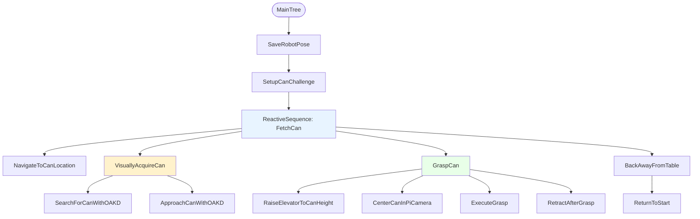
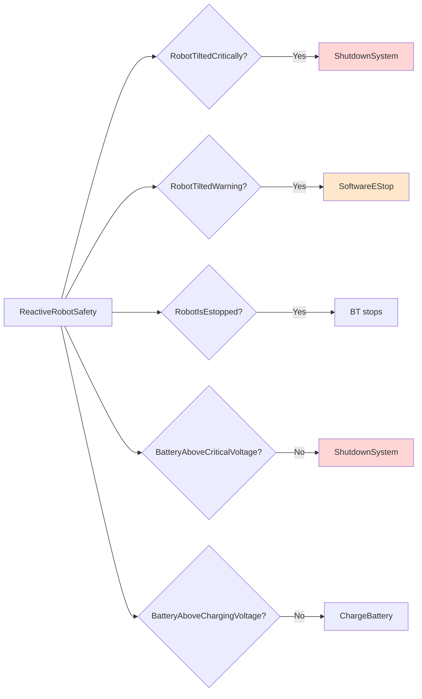

# Fetch Me a Beer: A Behavior Tree Walkthrough for ROS 2 Developers

**Date**: January 20, 2026  
**Audience**: ROS 2 developers with moderate skill and basic Behavior Tree familiarity  
**BT Source**: `can_do_challenge/bt_xml/main.xml`

## Why this BT works for “fetch me a beer”

The “fetch me a beer” task is a compact stress test for autonomy: the robot must navigate, perceive, manipulate, and remain safe in a dynamic environment. The behavior tree in `main.xml` solves this by **decomposing the mission into subtrees** and using **reactive control flow** to keep safety and perception live at all times.
Peter Ogren’s guidance emphasizes a few patterns that this BT uses heavily:
- **Reactive sequences and fallbacks** to re-check conditions continuously
- **Subtree modularity** so each piece can be tested and reused
- **Fallback chains** to degrade gracefully from ideal to robust behavior
- **Incremental refinement** with sensor feedback loops
- **Backward chaining** from the goal to the required prerequisites

This document explains how those ideas are applied.

## Big picture: the mission tree

The root `MainTree` captures the mission flow: save the start pose, set up, fetch the can, back away, and return to start.



### Key point: reactive execution

The `FetchCan` node is a **ReactiveSequence**. This means **every tick re-evaluates all children**. If perception changes or safety triggers, the tree responds immediately without being “stuck” in an old action.

## Safety: always-on, always first-class

Safety is implemented as its own subtree (`ReactiveRobotSafety`) using a **ReactiveSequence** of checks:

- `RobotHasNotFallenOver`
- `RobotIsNotAboutToFallOver`
- `RobotIsNotEStopped`
- `EnsureBatteryIsNotCritical`
- `BatteryIsCharged`

Each of those uses **Inverter + ReactiveFallback** patterns to convert a bad condition into a shutdown or E-stop action.



**Ogren principle**: safety is a parallel concern. It should not be a one-time check, and it should not depend on “remembering” to check it in each action. Reactive sequences solve that.

## Backward chaining: goals drive prerequisites

Backward chaining shows up most clearly in navigation and approach:

- Goal: “robot is near the can”
- Prereq: “compute a feasible approach pose”
- Prereq: “navigate to that pose”

This is captured in `ApproachCanWithOAKD`:

```xml
<ReactiveFallback name="GetWithinReach">
  <Condition ID="CanWithinReach" />
  <ReactiveFallback>
    <Action ID="MoveTowardsCan" />
    <Decorator ID="ReactiveRepeatUntilSuccessOrCount" num_cycles="1000">
      <Sequence>
        <Action ID="ComputeApproachGoalToCan" />
        <Action ID="NavigateToPoseAction" />
      </Sequence>
    </Decorator>
  </ReactiveFallback>
</ReactiveFallback>
```

**Interpretation**: keep asking “are we within reach?” If not, try the cheapest action (`MoveTowardsCan`). If that fails, plan a proper navigation goal and move there. That’s backward chaining in action: the **goal is checked first**, and prerequisites are attempted only when needed.

## Task decomposition: subtrees as reusable skills

The BT uses a strong decomposition strategy:

- **Navigation skill**: `NavigateToCanLocation`
- **Visual acquisition skill**: `SearchForCanWithOAKD` + `ApproachCanWithOAKD`
- **Manipulation skill**: `GraspCan` (composed of raising, centering, executing, retracting)
- **Safety skill**: `ReactiveRobotSafety`

Each subtree has a clean contract and shared blackboard data (`__shared_blackboard="true"`). That matches Ogren’s modularity principle: **small trees are easier to test and reason about**.

## Visual acquisition: search then approach

The `VisuallyAcquireCan` subtree is a **two-phase strategy**: first find, then approach.


The `SearchForCanWithOAKD` subtree uses a **ReactiveRepeatUntilSuccessOrCount** decorator to rotate and keep checking. The `ForceFailure` wrapper ensures the fallback keeps trying until detection is found (or the rotation budget is exhausted).

## Manipulation: controlled, sensor-driven steps

The grasping sequence is deliberately **incremental**:

- Raise elevator in steps (`StepElevatorUp`), waiting for new camera frames
- Center the can in the Pi camera view
- Extend, close gripper, lift slightly
- Verify the can is grasped

This is a classic **sense–act–sense** loop, the kind of feedback cycle Ogren recommends when dealing with uncertain perception and mechanical variability.


## One-time work with flags (avoid redoing expensive tasks)

The tree uses boolean flags on the blackboard:

- `needToNavigate`
- `needToVisuallyAcquire`
- `needToGrasp`

Each major subtree begins with:

```xml
<Condition ID="CheckBoolFlag" expected="false" flag="{needToNavigate}" />
```

If the task is already complete, the subtree exits quickly. If not, it performs the work and flips the flag to `false`. This pattern is common in Ogren’s examples because it avoids repeated execution of costly actions during reactive ticking.

## How the BT handles failure and recovery

The BT is designed with **fallback-based recovery**:

- Search uses rotation if detection fails
- Approach uses a cheap move before heavier navigation
- Grasp verifies success and reports failure rather than continuing blindly
- Safety can shut down or E-stop at any time

This produces **graceful degradation** rather than brittle success/failure behavior.

## Summary of Ogren-inspired techniques used

- **ReactiveSequence** for continuous monitoring and reactivity
- **ReactiveFallback** for multi-strategy recovery
- **Inverter + Fallback** for safety condition checks
- **Subtree modularity** to isolate skills
- **Blackboard data** for shared state and gating with flags
- **Backward chaining** by checking goals first and triggering prerequisites only when needed
- **Incremental refinement** with sensor feedback

## Practical takeaways for ROS 2 developers

If you are building similar autonomy with BehaviorTree.CPP, this BT shows a reliable template:

1. **Put safety in a reactive subtree** and tick it continuously.
2. **Decompose tasks into subtrees** and share data via a common blackboard.
3. **Use fallbacks to express multiple strategies** instead of one brittle approach.
4. **Gate expensive tasks with flags** to prevent repeated execution.
5. **Prefer sense–act–sense loops** over one-shot commands when uncertainty is high.

## Appendix: Subtrees in `main.xml`

- `MainTree`
- `SetupCanChallenge`
- `ReactiveRobotSafety`
- `NavigateToCanLocation`
- `VisuallyAcquireCan`
- `SearchForCanWithOAKD`
- `ApproachCanWithOAKD`
- `GraspCan`
- `RaiseElevatorToCanHeight`
- `CenterCanInPiCamera`
- `ExecuteGrasp`
- `RetractAfterGrasp`
- `ReturnToStart`
- `BatteryIsCharged`
- `EnsureBatteryIsNotCritical`
- `RobotHasNotFallenOver`
- `RobotIsNotAboutToFallOver`
- `RobotIsNotEStopped`

---

If you want, I can add a short section mapping each subtree to its ROS 2 node/plugin implementation or include a Groot snapshot diagram.