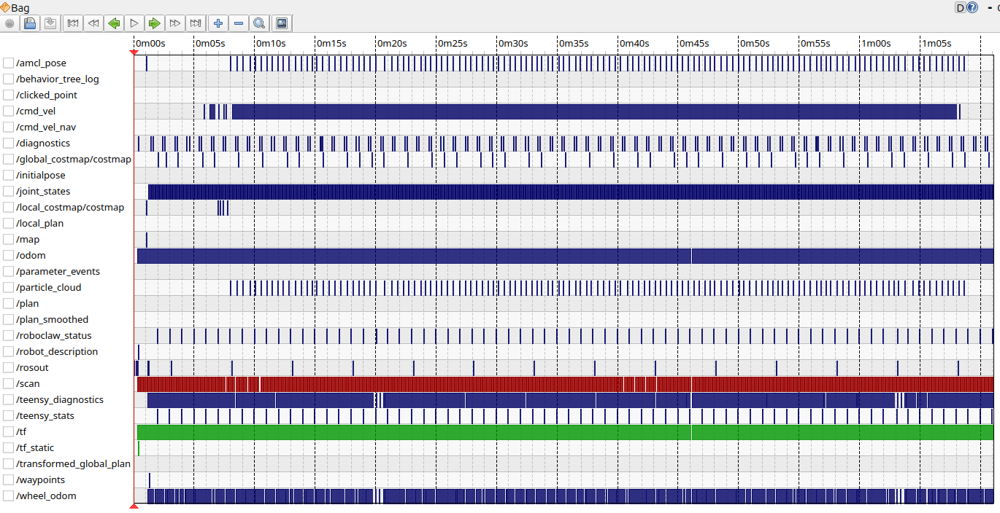
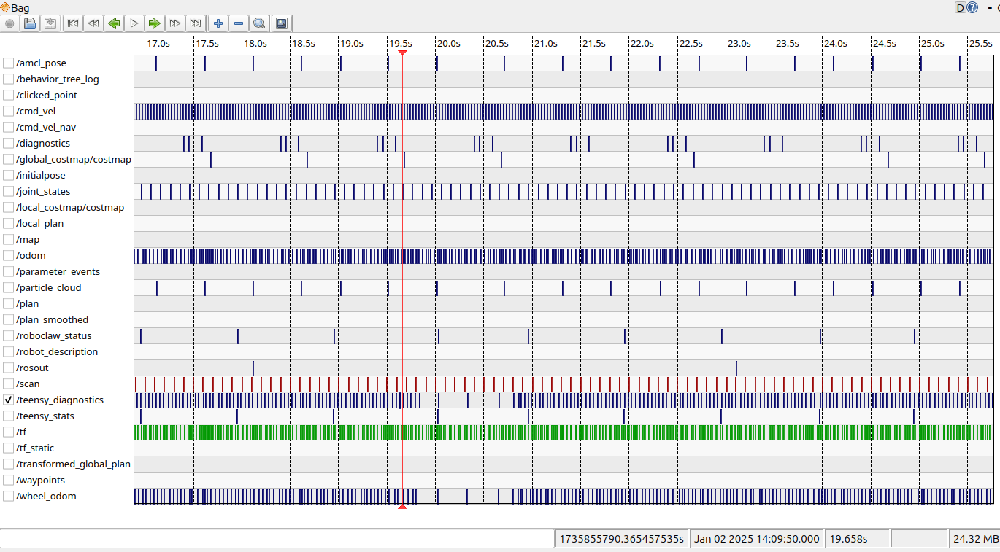

* I started up the nav stack.
* used ros2 bag record to record all published topics.
* I used teleop_keyboard to move the robot in a circle for several minutes, until I saw
  the robot hesitate twice.
* I used rqt_bag rosbag2_2025_01_02-14_09_30/ at all the topics over time. Here is the display:
   
* I magnified the display to see the time of the first hesitation. I gragged he timeline over
  to near the first hesitation and then jogged the playback until the timeline was a bit
  before the hesitation. I noted the time from the begining was 19.658 seconds.
  
* I decided that a good time for playback of the events was 19.6 seconds from the start.
* I started the foxglove studio brige via `ros2 launch foxglove_bridge foxglove_bridge_launch.xml`.
* I started a playback of the bag from 19.6 seconds into the bag with
`ros2 bag play --topics /cmd_vel /diagnostics /odom /roboclaw_status /teensy_diagnostics /teensy_stats /wheel_odom --start-offset 19.6 --start-paused rosbag2_2025_01_02-14_09_30/`
* I brought up foxglove studio and set it to display the contents of the following topics:
  * /cmd_vel  
    This would show the teleop_keyboard commands being sent to the robot.
  * /diagnostics  
    I was curious what was coming out here.
  * /roboclaw_status  
    This would show me if the motor driver software was detecting any errors when talking to the
    RoboClaw motor controller.
  * /teensy_diagnostics  
    This would show me the instrumented trace/debug messages I had inserted into the motor driver software.
  * /teensy_stats  
    This would show me the execution statistics of the various modules in the motor driver software.
  * /wheel_odom  
    This would show the wheel odometry data being published by the motor driver software.
  * Using the terminal with the `ros2 bag play` command, I began playing back the bag recording
    one frame at a time, noting the output shown in the various foxglove topic displays.
  * The thing that popped out to me was the data coming from the [`teensy_stats`] topic, Especially these three sequential reports:  
     
     ```code  
    "Stats": {"loops":67,"Ms":1081.8,"mdls":[{"n":"Batt","MnMxAv":[0.0,0.2,0.0]},{"n":"uRos","MnMxAv":[0.0,186.0,9.0]},{"n":"Rlay","MnMxAv":[0.0,0.0,0.0]},{"n":"Robo","MnMxAv":[6.6,8.2,7.1]},{"n":"TSd","MnMxAv":[0.0,0.0,0.0]}]}}'
    ---
    data: '{"Stats": {"loops":11,"Ms":927.3,"mdls":[{"n":"Batt","MnMxAv":[0.0,0.2,0.0]},{"n":"uRos","MnMxAv":[0.0,311.1,77.0]},{"n":"Rlay","MnMxAv":[0.0,0.0,0.0]},{"n":"Robo","MnMxAv":[6.6,7.8,7.3]},{"n":"TSd","MnMxAv":[0.0,0.0,0.0]}]}}'
    ---
    data: '{"Stats": {"loops":71,"Ms":991.9,"mdls":[{"n":"Batt","MnMxAv":[0.0,0.2,0.0]},{"n":"uRos","MnMxAv":[0.0,41.0,6.9]},{"n":"Rlay","MnMxAv":[0.0,0.0,0.0]},{"n":"Robo","MnMxAv":[6.2,8.4,7.1]},{"n":"TSd","MnMxAv":[0.0,0.0,0.0]}]}}'
    ```
  * What is notable is that the loops per second goes from 67, down to 11, then back up to 71. The loops per second should be somewhat close for each second.
  * When the loops per second drops to 11, what is noteworthy is that the time to execute the calls to the uRos module goes from 186 ms to 311 ms. This is a significant increase in time.
  * Inside the motor controller software, there is an interesting safety feature.
    There is a loop that runs at 40 hz (25 ms) that tries to process the last cmd_vel message received.
    Inside that loop, it looks at the previous time the loop ran and the current time, if that times
    exceeds 200 ms, the motors are commanded to stop.
    It appears that something may have interrupted that loop for 311.1 ms instead of a more normal 186 ms.
  * Up until the real time of 790.5037, the time stamps from the wheel_odom messages where ahead
    of the real time. E.g., at real time 790.5037 the wheel odom time stamp was 790.551, 47 ms ahead.
  * Then the wheel_odom times jump quite a bit backwards. At real time 790.7259 the wheel odom time
    stamp was 790.587, 138 ms behind. The time stays behind for 2 more slow messages.
  * Also, /teensy_diagnostics messages are slower to be published though /roboclaw_status messages
    and /teensy_stats are still being published at about the same rate. This makes sense as the
    /teensy_diagnostics messages are being published by the same module that is taking longer to
    run.
  * The puauses occur about every 42 seconds.
  * 
