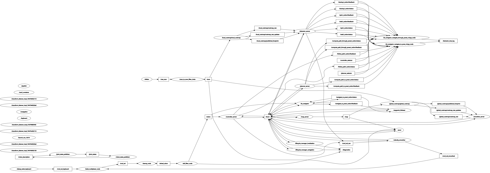

```bash
os@amdc:~$ ros2 node list
/amcl
/behavior_server
/bt_navigator
/bt_navigator_navigate_through_poses_rclcpp_node
/bt_navigator_navigate_to_pose_rclcpp_node
/controller_server
/ekf_filter_node
/global_costmap/global_costmap
/joint_state_publisher
/joystick
/keyboard
/launch_ros_12414
/ldlidar
/lifecycle_manager_localization
/lifecycle_manager_navigation
/local_costmap/local_costmap
/map_server
/nav2_container
/navigation
/planner_server
/robot_state_publisher
/rqt_gui_py_node_3914400
/scan_to_scan_filter_chain
/smoother_server
/teensy_node
/teleop_twist_keyboard
/transform_listener_impl_572f788bf440
/transform_listener_impl_764730002110
/transform_listener_impl_7647340020e0
/transform_listener_impl_76473c002110
/transform_listener_impl_764740002130
/transform_listener_impl_7647640020e0
/twist_multiplexer_node
/velocity_smoother
/waypoint_follower

```

```bash
ros@amdc:~$ ros2 topic list
ros@amdc:~$ ros2 topic list
/amcl/transition_event
/amcl_pose
/behavior_server/transition_event
/behavior_tree_log
/bluetoothJoystick
/bond
/bt_navigator/transition_event
/clock
/cmd_vel
/cmd_vel_joystick
/cmd_vel_keyboard
/cmd_vel_nav
/cmd_vel_smoothed
/cmd_vel_teleop
/controller_selector
/controller_server/transition_event
/cost_cloud
/diagnostics
/evaluation
/global_costmap/costmap
/global_costmap/costmap_raw
/global_costmap/costmap_raw_updates
/global_costmap/costmap_updates
/global_costmap/footprint
/global_costmap/global_costmap/transition_event
/global_costmap/obstacle_layer
/global_costmap/obstacle_layer_raw
/global_costmap/obstacle_layer_raw_updates
/global_costmap/obstacle_layer_updates
/global_costmap/published_footprint
/global_costmap/static_layer
/global_costmap/static_layer_raw
/global_costmap/static_layer_raw_updates
/global_costmap/static_layer_updates
/goal_pose
/gripper_cmd
/initialpose
/joint_states
/local_costmap/costmap
/local_costmap/costmap_raw
/local_costmap/costmap_raw_updates
/local_costmap/costmap_updates
/local_costmap/footprint
/local_costmap/lidar_layer
/local_costmap/lidar_layer_raw
/local_costmap/lidar_layer_raw_updates
/local_costmap/lidar_layer_updates
/local_costmap/local_costmap/transition_event
/local_costmap/published_footprint
/local_plan
/main_battery
/map
/map_server/transition_event
/marker
/odom
/parameter_events
/particle_cloud
/plan
/plan_smoothed
/planner_selector
/planner_server/transition_event
/preempt_teleop
/raw_scan
/received_global_plan
/roboclaw_status
/robot_description
/rosout
/scan
/set_pose
/smoother_server/transition_event
/speed_limit
/teensy_diagnostics
/teensy_stats
/tf
/tf_static
/transformed_global_plan
/velocity_smoother/transition_event
/waypoint_follower/transition_event
/wheel_odom
```

