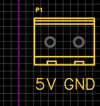
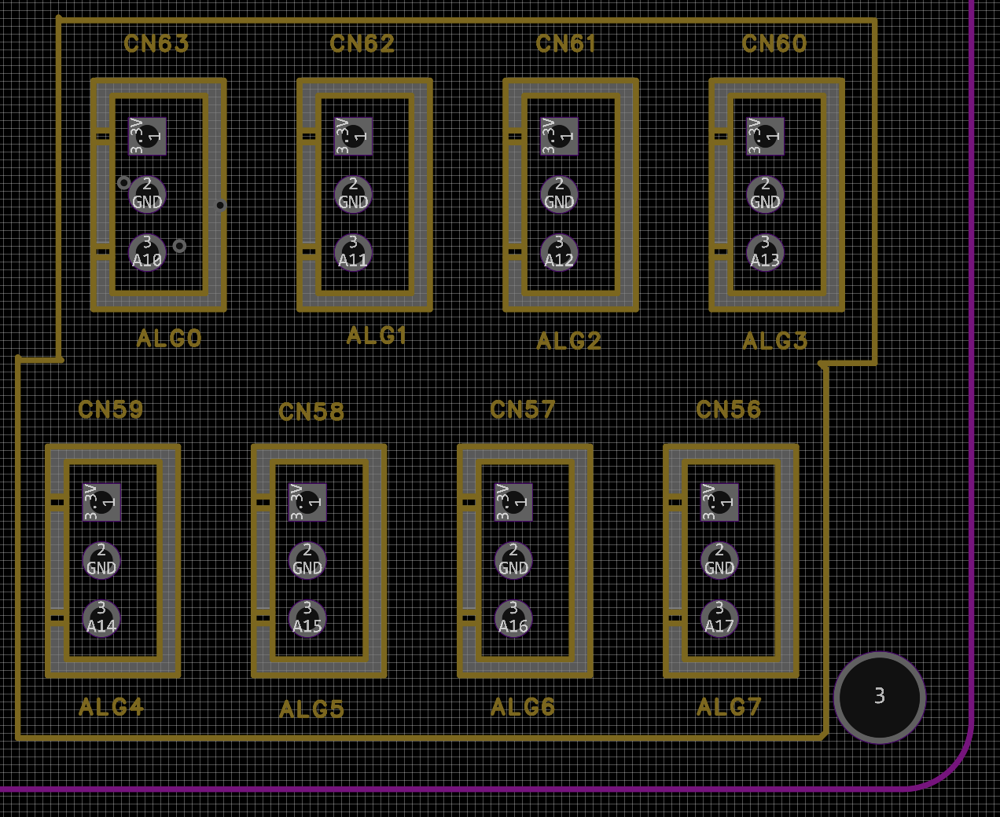
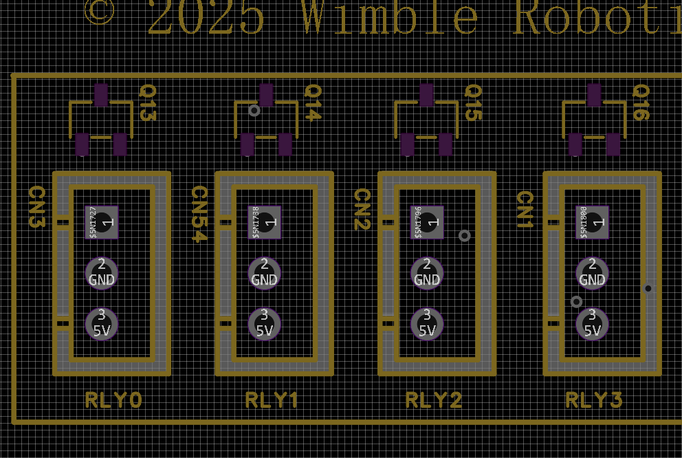
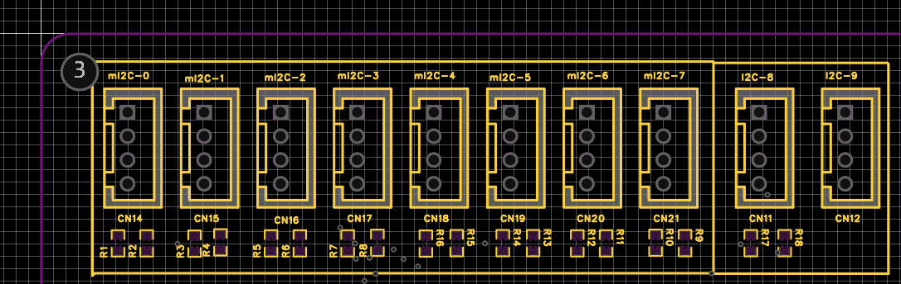
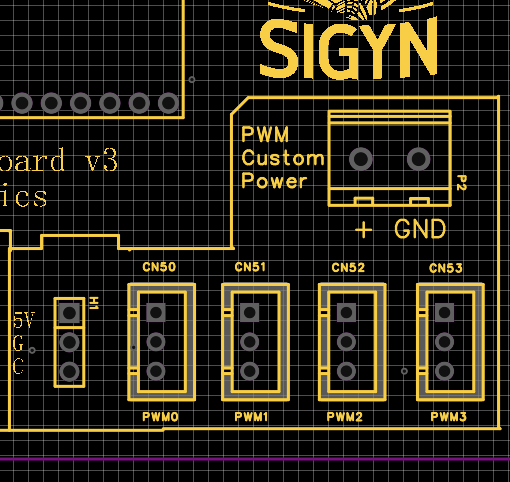
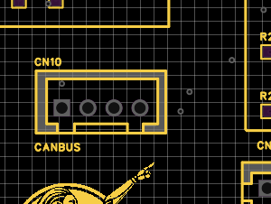
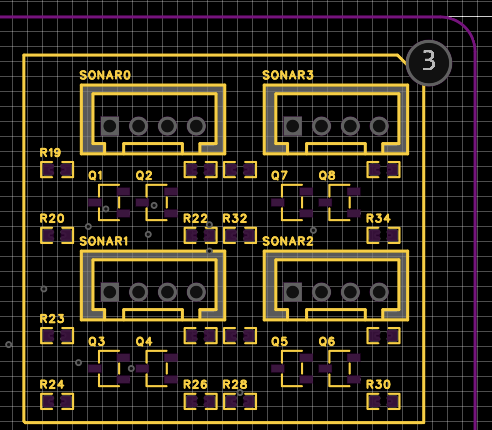
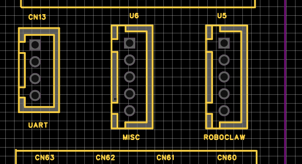

# The Teensy Sensor Board, from Wimble Robotics

Features of the **Teensy Sensor Board** 
* 8 I2C ports controlled by a multiplexer. This allows for multiple devices with the same I2C address to be used without conflicts. The clock and data busses have pull-up resistors.
* 2 non multiplexed I2C ports.
* 4 ports, each with a pair of bidirectional 5-volt level translators. Suitable for use with PING SONAR sensors.
* 2 SPI ports.
* A CANBUS port.
* 4 MOSFET-driven output ports intended for 5-volt level translation.
* 4 PWM ports with a jumper to power them from either the on-board 5-volt power rail or your own power rail.
* 8 Analog input ports.
* 3 extra, miscellaneous ports with UART capabilities, 2 also offering an additional bidirectional port.
* A 5-volt connector for external power input if you don’t just want to power everything from the USB port on the Teensy 4.1 chip.
* A power connector to supply custom power to the PWM ports, if selected via a jumper.

# 5 Volt Power Input
You should not use both the USB port and the 5 volt power port at the same time without modification to the Teensy 4.1 board itself. 
See [https://www.pjrc.com/store/teensy41.html](https://www.pjrc.com/store/teensy41.html). Otherwise, you can supply the 5 volt power via the power port.



# Analog Block
There are 8 analog connectors, labeled ***ALG0*** through ***ALG7***.
Each connector in the picture has pin 1 at the top and pin 3 at the bottom. Each pin's function is:

1. 3.3 volts. Can be used as a voltage reference or to power the sensor.
2. Ground.
3. Analog signal. Must be in the voltage range of 0 to 3.3.




To use the analog block, you would have code similar to this:

```code
  // Set the analog resolution, in bits for all analog pins.
  analogReadResolution(10);

  // Make sure the pin is not in output mode.
  // In this example, pin 24 corresponds to the port 
  // for the ALG0 connector.
  pinMode(24, INPUT);

  // Read the analog voltage.
  int16_t value = analogRead(24);
```

For a practical example, consider the TMP36 temperature
sensor from [AdaFruit](https://learn.adafruit.com/tmp36-temperature-sensor/overview). Their discussion gives:

> Temp in °C = [(Vout in mV) - 500] / 10
>
> So for example, if the voltage out is 1V that means that the temperature is ((1000 mV - 500) / 10) = 50 °C

Here is code that would read the sensor from the ***ALG0***
port and convert the result to a floating point value representing
tenths of a degree Centigrade.

```code
  // Get a reading that will read 0 to 3.3 volts spread
  // over 1024 buckets (10-bits).
  int raw = analogRead(24);

  // Scale and remove the offset voltage.
  float degreesC = ((raw * 3300 / 1024.0) - 0.5) / 10.0;
```

The pin number to be used for the [pinMode] and [analogRead] values are:

<div style="border:1px solid black; padding: 8px;">
<table>
  <tr>
    <th>Connector</th>
    <th>Pin Number</th>
  </tr>
  <tr>
    <td>ALG0</td>
    <td>24</td>
  </tr>
  <tr>
    <td>ALG1</td>
    <td>25</td>
  </tr>
  <tr>
    <td>ALG2</td>
    <td>26</td>
  </tr>
  <tr>
    <td>ALG3</td>
    <td>27</td>
  </tr>
  <tr>
    <td>ALG4</td>
    <td>38</td>
  </tr>
  <tr>
    <td>ALG5</td>
    <td>39</td>
  </tr>
  <tr>
    <td>ALG6</td>
    <td>40</td>
  </tr>
  <tr>
    <td>ALG7</td>
    <td>41</td>
  </tr>
</table>
</div>

<style>
table {
  border-collapse: collapse;
  width: 100%;
}
th, td {
  border: 1px solid black;
  text-align: left;
  padding: 8px;
}
th {
  background-color: #f2f2f2;
}
</style>

# Relay Block

There are 4 relay connectors, labeled ***RLY0*** through ***RLY3***.
The intent is that each connector acts as a switch. The output will
either be driven to ground or allowed to float, which means the switch
signal should be connected to a pull up resistor which then is connected
to the desired 'on' voltage for the switch. That maximum voltage
that can be switched is 5 volts.

Each connector in the picture has pin 1 at the top and pin 3 at the bottom. Each pin's function is:

1. The switched output. The output should include a pull up resistor to
the desired voltage, typically 3.3 volts or 5 volts. Don't exceed 5 volts.
In my original design, the pin was used to drive a solid state relay.
2. Ground.
3. A 5 volt reference. Can be used to power the switched device and/or
be used for that pull up resistor needed for pin 1.



To use the relay block, you would have code similar to this:

```code
  // Set the pin in output mode.
  // Here, 0 corresponds to the pin for RLY0.
  pinMode(0, OUTPUT);

  // Turn the switch off.
  digitalWrite(0, LOW);

  // Turn the switch on.
  digitalWrite(0, HIGH);
```

The pin number to be used for the [pinMode] and [digitalWrite] values are:

<div style="border:1px solid black; padding: 8px;">
<table>
  <tr>
    <th>Connector</th>
    <th>Pin Number</th>
  </tr>
  <tr>
    <td>RLY0</td>
    <td>0</td>
  </tr>
  <tr>
    <td>RLY1</td>
    <td>1</td>
  </tr>
  <tr>
    <td>RLY2</td>
    <td>2</td>
  </tr>
  <tr>
    <td>RLY3</td>
    <td>3</td>
  </tr>
</table>
</div>

# I2C Block
There are 8 multiplexed I2C connectors, labeled ***mI2C-0*** through 
***mI2C-7***, and two non-multiplexed I2C connectors, labeled
***I2C-8*** and ***I2C-9***.
Each connector in the picture has pin 1 at the top and pin 4 at
the bottom.
Each pin's function is:

1. 3.3 volts. Can be used to power the sensor.
2. Ground.
3. ***SDC***, the I2C clock.
4. ***SDA***, the I2C data.


To use the multiplexed block, you would have code similar to this:

```code
  // Enable the multiplexor chip.
  pinMode(8, OUTPUT);
  digitalWrite(8, HIGH);

  // Initialize the Wire library.
  Wire.begin();

  // Enable one of the multiplexed I2C connectors.
  // Replace 'sensor_index' with a value in the
  // closed interval [0, 7].
  #define I2C_MULTIPLEXER_ADDRESS 0x70
  Wire.beginTransmission(I2C_MULTIPLEXER_ADDRESS);
  Wire.write(1 << sensor_index);
  Wire.endTransmission();

  // Small delay to allow multiplexer to switch.
  delayMicroseconds(100);

  // Continue with I2C code
  ```

# PWM Block

There is a ***3-pin header*** to the left of the PWM block and you must
provide a 2-pin jump to select either the on-board 5 volt power rail 
or your own power rail. 
Short the top two pins (***5V*** and ***GND***) to use the on-board 5V rail, or short the bottom two pins (***GND*** and ***C***) to select
power from the ***PWM Custom Power*** port.

Each connector in the picture has pin 1 at the top and pin 3 at the
bottom. 

***NOTE: This pin ordering is NOT the same as is usual with a servo.
Make sure you remap the pins to match your servo device.***

Each pin's function is:

1. The power you selected from the ***3-pin header***.
2. Ground.
3. The PWM signal. Of course, this is just a connection to one of
the many Teensy I/O pins, and you have to set the pin to be in
PWM mode, as described below.

The Teensy pin the provides the signal for each connector is:

<div style="border:1px solid black; padding: 8px;">
<table>
  <tr>
    <th>Connector</th>
    <th>Logical Pin Name</th>
    <th>Digital Pin Number</th>
  </tr>
  <tr>
    <td>PWM0</td>
    <td>BCLK2</td>
    <td>4</td>
  </tr>
  <tr>
    <td>PWM1</td>
    <td>IN2</td>
    <td>5</td>
  </tr>
  <tr>
    <td>PWM2</td>
    <td>OUT1D</td>
    <td>6</td>
  </tr>
  <tr>
    <td>PWM3</td>
    <td>OUT1A</td>
    <td>7</td>
  </tr>
  </table>
</div>



To use the PWM block as pulse with modulated outputs,
you could use the Servo.h library. Here is an example:

```code
#include <Servo.h>

enum TeensySensorPWMPins {
  PWM0 = 4,
  PWM1 = 5,
  PWM2 = 6,
  PWM3 = 7,
};

Servo myservo;

void setup() {
  myservo.attach(PWM0);  // attaches the servo on pin 20
}

void loop() {
  for (int pos = 10; pos < 170;
       pos += 1)         // goes from 10 degrees to 170 degrees
  {                      // in steps of 1 degree
    myservo.write(pos);  // tell servo to go to position in variable 'pos'
    delay(15);           // waits 15ms for the servo to reach the position
  }
  for (int pos = 180; pos >= 1; pos -= 1)  // goes from 180 degrees to 0 degrees
  {
    myservo.write(pos);  // tell servo to go to position in variable 'pos'
    delay(15);           // waits 15ms for the servo to reach the position
  }
}
```

# CAN bus

Two of the pins that the Teensy intended for use as CAN bus
signals are brought out to a 4-pin connector. 
It is up to you to provide any additional hardware and physical
connector to complete the connection to a CAN bus.

The connector has pin 1 to the left and pin 4 to the right in the picture. Each pin's function is:

1. 3.3 volts.
2. Ground.
3. ***CRX1*** or digital pin 23.
4. ***CTX1*** or digital pin 22.

Of course, could use this connector as a UART or for any other
purpose. Just set up the proper pin mode in your code.



# SONAR Block

There are 4 SONAR connectors, labeled ***SONAR0*** through ***SONAR3***.
The intent is that each connector is attached to a HC-SR04 ultrasonic sensor.
Each connector in the picture has pin 1 to the left and pin 4 to the right.
Each pin's function is:

1. 5 volts.
2. Ground.
3. Trigger.
4. Echo.



No example code is given here, as the code I use is designed to use
interrupt handlers and timers to stagger the handling of the 4 SONAR
sensors and minimize execution time so that I can send as many SONAR
reports as possible.

The digital pin number to be used for trigger and echo for each connector is:

<div style="border:1px solid black; padding: 8px;">
<table>
  <tr>
    <th>Connector</th>
    <th>Trigger</th>
    <th>Echo</th>
  </tr>
  <tr>
    <td>SONAR0</td>
    <td>24</td>
    <td>25</td>
  </tr>
  <tr>
    <td>SONAR1</td>
    <td>26</td>
    <td>27</td>
  <tr>
  <tr>
    <td>SONAR2</td>
    <td>28</td>
    <td>29</td>
  </tr>
  <tr>
    <td>SONAR3</td>
    <td>36</td>
    <td>37</td>
  <tr>
</table>
</div>

# Miscellaneous connectors



## RoboClaw Connector

This connector has pin 1 at the top and pin 5 at the bottom. Each pin's function is:

1. 3.3 volts.
2. Ground.
3. RX7 (digital pin 28). Should be connected to pin S2 on the RoboClaw.
4. TX7 (digital pin 29). Should be connected to pin S1 on the RoboClaw.
5. CRX3 (digital pin 30). Should be connected to pin 