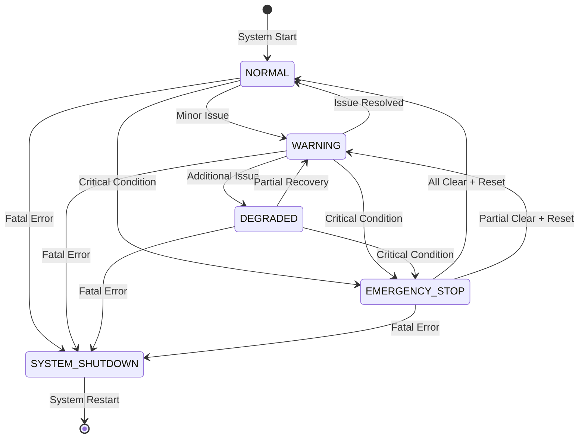

# TeensyV2 Safety System Design

## Overview

The TeensyV2 safety system implements a comprehensive, multi-layered approach to ensuring safe operation of the Sigyn robotic platform. The system coordinates safety across multiple Teensy boards, provides multiple E-stop sources, and implements both automatic and manual recovery mechanisms.

## Safety Philosophy

### Core Principles

1. **Fail-Safe Design**: The system defaults to a safe state when any component fails
2. **Defense in Depth**: Multiple independent safety layers prevent single points of failure
3. **Transparent Operation**: All safety conditions are visible and trackable
4. **Graceful Recovery**: Automatic recovery when conditions clear, manual override when needed
5. **Real-Time Response**: Safety violations trigger immediate protective actions

### Safety Hierarchy

```
Level 0: Hardware E-Stop (immediate physical cutoff)
Level 1: Software E-Stop (coordinated system shutdown)
Level 2: Performance E-Stop (timing/resource violations)
Level 3: Sensor E-Stop (critical sensor failures)
Level 4: Battery E-Stop (power system protection)
```

## System Architecture

### Multi-Board Coordination

The TeensyV2 system operates across two Teensy 4.1 boards with coordinated safety:

#### Board 1 (Main Controller)
- **Primary Safety Authority**: Makes final E-stop decisions
- **Hardware E-Stop Input**: Physical emergency stop button
- **Motor Control Safety**: Monitors motor currents and velocities
- **Inter-Board Coordination**: Receives safety signals from Board 2
- **Safety Output**: Controls relay/contactor for system power cutoff

#### Board 2 (Sensor Board)
- **Sensor Monitoring**: Battery, IMU, temperature sensors
- **Safety Reporting**: Reports critical conditions to Board 1
- **Backup Safety**: Can signal emergency conditions via GPIO
- **Autonomous Protection**: Local protection for battery/charging systems

### Safety Signal Flow

```
[Physical E-Stop] → [Board 1] → [Motor Controllers]
                               ↓
[Battery Critical] → [Board 2] → [Board 1] → [ROS2 System]
                               ↓
[Performance Issues] → [Both Boards] → [Safety Coordinator]
                                     ↓
[Software Commands] → [ROS2] → [Board 1] → [System Shutdown]
```

## E-Stop Sources

### Hardware E-Stop (Level 0)
- **Trigger**: Physical emergency stop button
- **Response Time**: <1ms (hardware-level cutoff)
- **Recovery**: Manual reset required after button release
- **Scope**: Immediate power cutoff to motor systems

**Implementation:**
- GPIO input with hardware interrupt
- Direct connection to safety relay/contactor
- Independent of software operation
- Fail-safe: Open circuit = E-stop active

### Software E-Stop (Level 1)
- **Trigger**: ROS2 command, navigation system, user interface
- **Response Time**: <10ms (software processing delay)
- **Recovery**: Manual reset via ROS2 command
- **Scope**: Coordinated shutdown of all robot systems

**Implementation:**
- ROS2 topic subscription: `/sigyn/commands/estop`
- Message-based communication to embedded systems
- Requires acknowledgment from all boards
- Graceful shutdown sequence

### Performance E-Stop (Level 2)
- **Trigger**: Timing violations, resource exhaustion, system overload
- **Response Time**: <100ms (monitoring cycle dependent)
- **Recovery**: Automatic when conditions clear (configurable delay)
- **Scope**: Prevents system damage from performance issues

**Monitored Conditions:**
- Loop frequency below critical threshold (50Hz)
- Module execution time exceeding limits (>5ms)
- Memory exhaustion or allocation failures
- Communication timeouts between boards

### Sensor E-Stop (Level 3)
- **Trigger**: Critical sensor failures or invalid readings
- **Response Time**: <100ms (sensor update dependent)
- **Recovery**: Automatic when sensor restored (configurable delay)
- **Scope**: Prevents operation with insufficient sensory information

**Monitored Sensors:**
- Battery monitoring (voltage/current sensors)
- Motor position/velocity feedback
- Critical navigation sensors (if configured)
- Temperature sensors (thermal protection)

### Battery E-Stop (Level 4)
- **Trigger**: Critical battery conditions
- **Response Time**: <100ms (battery monitoring frequency)
- **Recovery**: Automatic when conditions normalize
- **Scope**: Protects battery system and prevents damage

**Monitored Conditions:**
- Voltage below critical threshold (32.0V default)
- Current above critical threshold (15.0A default)
- Power consumption above limits (500W default)
- Temperature outside safe range (if available)

## Safety State Machine

### States

#### NORMAL
- **Description**: All systems operational within normal parameters
- **Indicators**: Green status LED, normal operation permitted
- **Transitions**: To WARNING on minor issues, to ESTOP on critical conditions

#### WARNING
- **Description**: Minor issues detected, continued operation with monitoring
- **Indicators**: Yellow status LED, warning messages
- **Transitions**: To NORMAL when issues resolve, to DEGRADED on additional issues

#### DEGRADED
- **Description**: Operating with reduced capability due to non-critical failures
- **Indicators**: Orange status LED, limited operation permitted
- **Transitions**: To WARNING when issues partially resolve, to ESTOP on critical conditions

#### EMERGENCY_STOP
- **Description**: Emergency stop active, all motion disabled
- **Indicators**: Red status LED, all motors disabled
- **Transitions**: To NORMAL/WARNING when all conditions clear and reset performed

#### SYSTEM_SHUTDOWN
- **Description**: Complete system shutdown required, restart needed
- **Indicators**: Blinking red LED, system halt
- **Transitions**: Only via system restart

### State Transitions



## Recovery Mechanisms

### Automatic Recovery
- **Conditions**: Transient issues that self-resolve
- **Examples**: Temporary performance violations, sensor communication glitches
- **Implementation**: Configurable delay period before attempting recovery
- **Safety**: Multiple consecutive recoveries may trigger manual reset requirement

### Manual Recovery
- **Conditions**: Persistent issues requiring human intervention
- **Examples**: Hardware E-stop button, software emergency commands
- **Implementation**: Explicit reset command via ROS2 service or hardware button
- **Safety**: Requires verification that triggering condition has been addressed

### Graceful Degradation
- **Concept**: Continue limited operation when non-critical systems fail
- **Examples**: Operate with reduced sensors, lower performance limits
- **Implementation**: Reconfigure system parameters and operating modes
- **Safety**: Stricter monitoring and faster response to additional failures

## Configuration Parameters

### Safety Thresholds
```yaml
safety:
  # E-stop recovery
  enable_auto_recovery: true
  recovery_delay: 1.0                    # seconds
  max_consecutive_violations: 3
  
  # Battery thresholds
  critical_battery_voltage: 32.0         # volts
  warning_battery_voltage: 34.0          # volts
  critical_battery_current: 15.0         # amperes
  
  # Performance thresholds
  critical_loop_frequency: 50.0          # Hz
  critical_execution_time: 5.0           # milliseconds
  max_performance_violations: 5
  
  # Hardware configuration
  enable_hardware_estop: true
  enable_software_estop: true
  enable_inter_board_safety: true
```

### Pin Assignments
```cpp
// Board 1 (Main Controller)
constexpr uint8_t HARDWARE_ESTOP_PIN = 2;      // Input, active low
constexpr uint8_t ESTOP_OUTPUT_PIN = 3;        // Output, active high
constexpr uint8_t INTER_BOARD_INPUT_PIN = 4;   // Input from Board 2
constexpr uint8_t INTER_BOARD_OUTPUT_PIN = 5;  // Output to Board 2
constexpr uint8_t STATUS_LED_PIN = 13;         // Status indicator

// Board 2 (Sensor Board)
constexpr uint8_t SAFETY_SIGNAL_PIN = 6;       // Output to Board 1
constexpr uint8_t STATUS_LED_PIN = 13;         // Status indicator
```

## Message Protocol Integration

### Safety Status Messages
```
SAFETY:state=NORMAL,hw_estop=false,inter_board=false,active_conditions=false
SAFETY:state=ESTOP,hw_estop=true,inter_board=false,active_conditions=true,sources=HARDWARE
```

### E-Stop Event Messages
```
ESTOP:active=true,source=BATTERY_VOLTAGE,reason=Critical low voltage,value=31.25,manual_reset=false,time=125430
ESTOP:active=false,source=PERFORMANCE,reason=Timing recovered,manual_reset=false,time=127890
```

### Diagnostic Messages
```
DIAG:level=ERROR,module=SafetyCoordinator,msg=Multiple safety violations,details=battery+performance,time=98765
DIAG:level=INFO,module=SafetyCoordinator,msg=Automatic recovery successful,details=source=BATTERY_VOLTAGE,time=98770
```

## ROS2 Integration

### Topics

#### Published
- `/sigyn/safety/estop_status` (std_msgs/Bool): Current E-stop state
- `/sigyn/safety/safety_status` (diagnostic_msgs/DiagnosticArray): Detailed safety status
- `/sigyn/safety/violations` (custom): Safety violation reports

#### Subscribed
- `/sigyn/commands/estop` (std_msgs/Bool): Software E-stop trigger
- `/sigyn/commands/reset_estop` (std_msgs/String): E-stop reset commands

### Services
- `/sigyn/safety/trigger_estop`: Trigger emergency stop with reason
- `/sigyn/safety/reset_estop`: Reset specific or all E-stop conditions
- `/sigyn/safety/get_status`: Get detailed safety system status

### Parameters
- Runtime configuration of safety thresholds
- Enable/disable specific safety sources
- Configure recovery behavior and timeouts

## Testing and Validation

### Unit Tests
- Individual safety condition detection
- State machine transition logic
- Message parsing and generation
- Recovery mechanism timing

### Integration Tests
- Multi-board coordination
- Hardware E-stop functionality
- ROS2 service/topic integration
- Parameter update propagation

### Hardware-in-Loop Tests
- Physical E-stop button operation
- Battery disconnect scenarios
- Inter-board communication failures
- Performance violation injection

### Safety Validation
- Failure mode analysis
- Recovery time measurement
- Stress testing under load
- Long-term reliability testing

## Maintenance and Diagnostics

### Health Monitoring
- Continuous self-diagnostics
- Safety system integrity checks
- Communication link validation
- Hardware input verification

### Logging and Analysis
- Comprehensive safety event logging
- Performance trend analysis
- Failure pattern detection
- Predictive maintenance alerts

### Troubleshooting Guide
- Common safety condition causes
- Reset procedure verification
- Hardware diagnostic procedures
- Software debugging techniques

This safety system design provides robust protection for the Sigyn robotic platform while maintaining operational flexibility and diagnostic capability.
