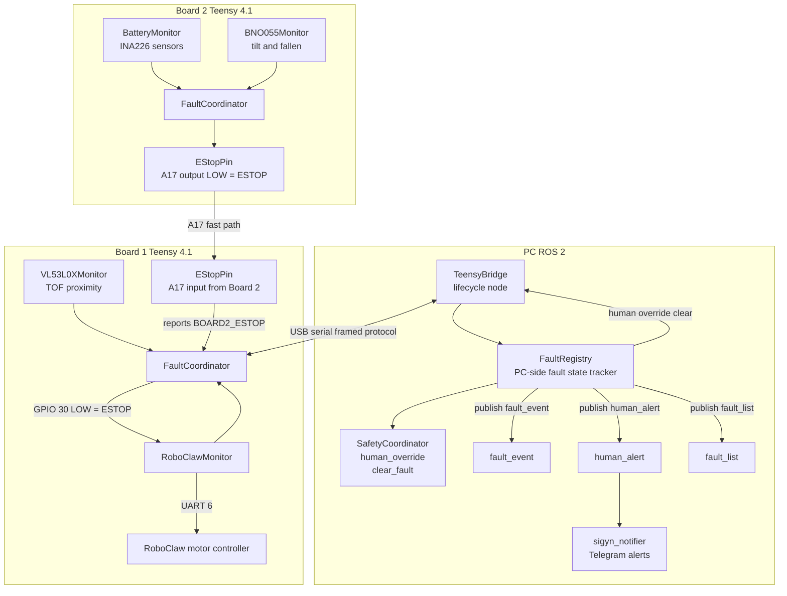
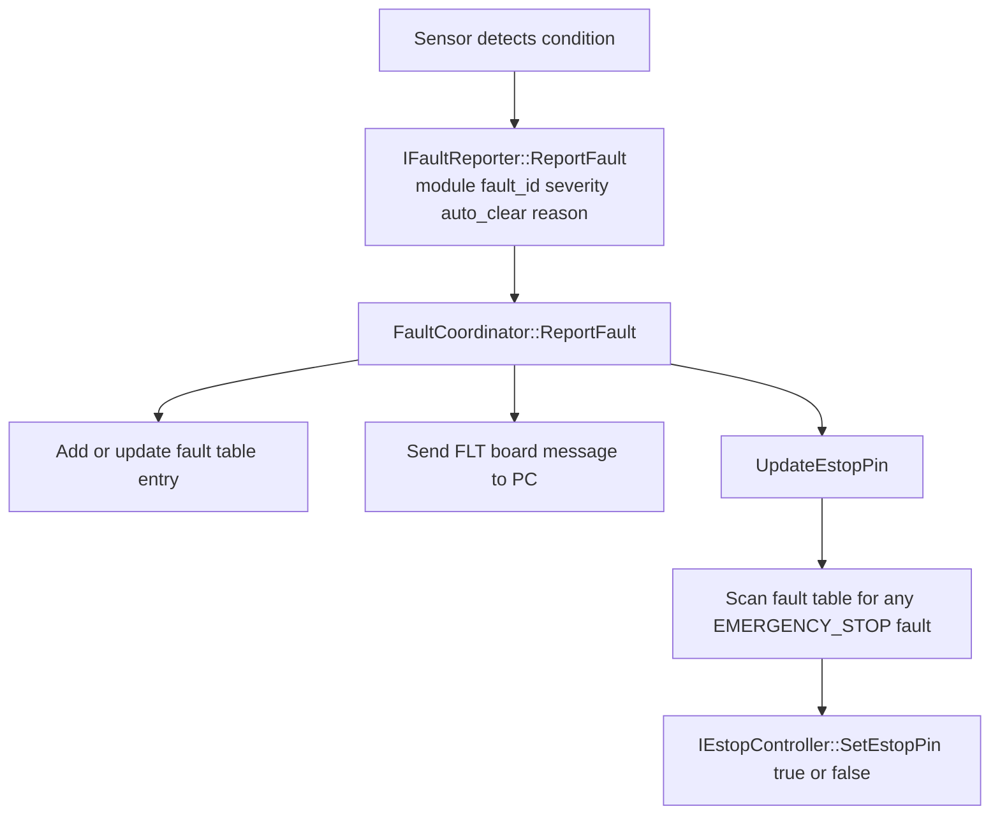
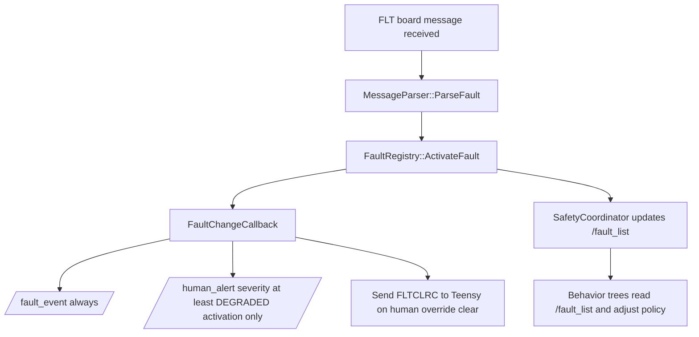
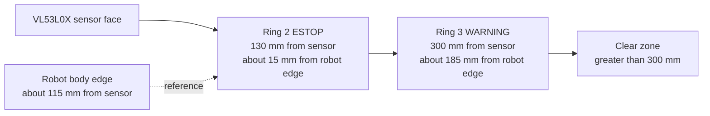

# Sigyn Safety System — Architecture and Implementation Reference

**Audience:** Programmers maintaining or extending Sigyn's safety system.  
**Prerequisites:** Familiarity with ROS 2 lifecycle nodes, Teensy 4.1 firmware, and the wr_proto_msgs serial framing protocol.

---

## 1. Motivation and Design Philosophy

Sigyn is an **assistive home robot**. Its primary purpose is to help a person who may live alone, have limited mobility, or depend on the robot to perform routine tasks — including potentially delivering medication or performing actions where physical delivery matters more than conservative caution.

This creates a unique safety contract:

- The robot **must not injure** a person, a pet, or damage property under normal circumstances.
- The robot **must be trustworthy enough** that the person is genuinely comfortable having it move around them.
- The person **must be able to override** safety decisions when they understand the risk and choose to accept it. For example: if the robot's obstacle-proximity sensor is triggered by the user's wheelchair and the user needs their medicine delivered right now, the user must be able to say "I know, go ahead."
- **Power cycling** is an extreme remedy. It should never be the required resolution for a safety interlock that could otherwise be cleared programmatically.

The guiding principles therefore are:

1. **Layered protection** — multiple independent sensors; none is a single point of failure.
2. **Hardware-enforced E-STOP** — safety does not rely solely on software; a GPIO pin holds the motor controller in E-STOP independently of the CPU.
3. **Self-healing by default** — transient conditions (obstacle clears, current drops, comm recovers) release the E-STOP automatically.
4. **Latching for serious events** — non-transient conditions (robot fell over, motor ran away) require a human to explicitly acknowledge before motion resumes.
5. **Human override is a first-class feature** — the system is designed with the expectation that the user will sometimes need to override caution, and the path to doing so is fast and reliable, not buried.
6. **Transparency** — the operator always knows what the robot's safety state is and why, via Telegram notifications and ROS 2 topics.

---

## 2. High-Level Architecture



---

## 3. Hardware Topology

### Board 1 (Teensy 4.1)
| Resource | Role |
|---|---|
| USB serial | Bidirectional protocol link to PC (`TeensyBridge`) |
| UART 6 | RoboClaw motor controller serial |
| GPIO 30 | **OUTPUT** — RoboClaw hardware ESTOP input. LOW = stop motors immediately, regardless of software |
| A17 / GPIO 41 | **INPUT** — Fast-path signal from Board 2. LOW = Board 2 has an active ESTOP-level fault |
| I²C (400 kHz) | Up to 8 VL53L0X time-of-flight proximity sensors |

### Board 2 (Teensy 4.1)
| Resource | Role |
|---|---|
| USB serial | Bidirectional protocol link to PC (`TeensyBridge`) |
| A17 / GPIO 41 | **OUTPUT** — Fast-path ESTOP signal driven to Board 1. LOW = Board 2 asserts ESTOP |
| I²C | BNO055 IMU (orientation/tilt) |
| I²C | INA226 battery/power-rail current sensors |

### Key Design Point: Who Drives the RoboClaw ESTOP

**Board 1 is the sole driver of GPIO 30** (the RoboClaw hardware ESTOP pin). Board 2 cannot reach the RoboClaw directly. Instead, when Board 2 needs to assert ESTOP:

1. Board 2's `FaultCoordinator` calls `EStopPin::SetEstopPin(true)` → drives A17 LOW.
2. Board 1's `EStopPin::Loop()` detects A17 LOW → calls `FaultCoordinator::ReportFault(kBoard2Estop)`.
3. Board 1's `FaultCoordinator` calls `RoboClawMonitor::SetEstopPin(true)` → GPIO 30 goes LOW.

---

## 4. Fault Lifecycle

### 4.1 On the Teensy (Firmware)

Every safety condition is expressed as a **fault** managed by `FaultCoordinator`.



**On Board 1**, `IEstopController` is `RoboClawMonitor`:

- `SetEstopPin(true)` → `AssertEstop()` → zeros `cmd_vel`, drives GPIO 30 LOW, commands RoboClaw speed = 0 via serial.
- `SetEstopPin(false)` → `ReleaseEstop()` → zeros `cmd_vel`, drives GPIO 30 HIGH.

**On Board 2**, `IEstopController` is `EStopPin`:

- `SetEstopPin(true)` → drives A17 LOW (Board 1 detects this immediately in firmware).
- `SetEstopPin(false)` → drives A17 HIGH.

### 4.2 On the PC (ROS 2)

Wire messages (`FLT<n>:{...}`) pass through `TeensyBridge` into `FaultRegistry`.



### 4.3 Fault Clearing

| Path | Trigger | Target |
|---|---|---|
| Auto-clear on firmware | Sensor condition resolves; module calls `ClearFault()` | Teensy FaultCoordinator + PC FaultRegistry |
| Human override | Operator calls `/human_override` ROS service | PC FaultRegistry → FLTCLRC wire → Teensy FaultCoordinator |
| PC self-clear on ACK | PC receives `FLTCLRC` from Teensy (future) | PC FaultRegistry |

**Important:** When a human clears a latching fault, `TeensyBridge::FaultChangeCallback` sends a `FLTCLRC` wire command to the Teensy. Without this step, the Teensy's `FaultCoordinator` would keep the fault active and GPIO 30 would remain LOW even after the human acknowledges. The FLTCLRC send was added to `teensy_bridge.cpp`.

---

## 5. Fault Catalog

All fault ID strings are defined in `wr_proto_msgs/include/wr_proto_msgs/fault_ids.h`.

### 5.1 Severity Levels

| Level | Value | Meaning |
|---|---|---|
| `WARNING` | 1 | Degraded performance; no E-STOP. Behavior trees may re-plan. |
| `DEGRADED` | 2 | Significant capability loss; no E-STOP. |
| `EMERGENCY_STOP` | 3 | Hardware E-STOP asserted; robot cannot move. |
| `CRITICAL` | 4 | Used for board-lost (PC-side); implies E-STOP and autonomy halt. |
| `SYSTEM_SHUTDOWN` | 5 | Reserved for catastrophic events. |

### 5.2 Complete Fault Table

| Fault ID | Wire String | Source | Board | Severity | auto_clear | Latching? | Notes |
|---|---|---|---|---|---|---|---|
| `kVl53l0xRing2` | `VL53L0X_RING2` | VL53L0X proximity | 1 | EMERGENCY_STOP | true | No | 8 instances (0–7), one per sensor; each reported and cleared independently; clears when obstacle leaves ring 2; human can override while obstacle still present |
| `kVl53l0xRing3` | `VL53L0X_RING3` | VL53L0X proximity | 1 | WARNING | true | No | 8 instances (0–7), one per sensor; each independent of ring 2; behavior-tree only; no Telegram |
| `kMotorRunawayM1` | `RUNAWAY_M1` | RoboClawMonitor | 1 | EMERGENCY_STOP | false | **Yes** | Motor 1 speed exceeded threshold; requires human override; no power cycle needed |
| `kMotorRunawayM2` | `RUNAWAY_M2` | RoboClawMonitor | 1 | EMERGENCY_STOP | false | **Yes** | Motor 2 speed exceeded threshold; requires human override; no power cycle needed |
| `kMotorHwOvercurrM1` | `HW_OVERCURR_M1` | RoboClawMonitor | 1 | EMERGENCY_STOP | true | No | RoboClaw hardware M1_CURRENT_ERROR bit set; threshold set very high on device to avoid false triggers; self-heals when bit clears (e.g., after SSR power cycle) |
| `kMotorHwOvercurrM2` | `HW_OVERCURR_M2` | RoboClawMonitor | 1 | EMERGENCY_STOP | true | No | RoboClaw hardware M2_CURRENT_ERROR bit set; same self-heal policy as M1 |
| `kMotorSwOvercurrM1` | `SW_OVERCURR_M1` | RoboClawMonitor | 1 | EMERGENCY_STOP | true | No | Software (averaged) measurement of M1 current exceeded `max_current_m1`; self-heals when measured current drops |
| `kMotorSwOvercurrM2` | `SW_OVERCURR_M2` | RoboClawMonitor | 1 | EMERGENCY_STOP | true | No | Software (averaged) measurement of M2 current exceeded `max_current_m2`; self-heals when measured current drops |
| `kMotorCommFail` | `MOTOR_COMM_FAIL` | RoboClawMonitor | 1 | EMERGENCY_STOP | true | No | Clears on successful reconnect |
| `kRoboclawError` | `RCLW_ERR` | RoboClawMonitor | 1 | EMERGENCY_STOP | true | No | Clears when fatal error bits clear from hardware |
| `kMotorOvertemp` | `MOTOR_OVERTEMP` | RoboClawMonitor | 1 | EMERGENCY_STOP | true | No | Clears when temperature drops below threshold |
| `kBoard2Estop` | `BOARD2_ESTOP` | EStopPin (Board 1) | 1 | EMERGENCY_STOP | true | No | Reported on Board 1 when A17 goes LOW; clears when A17 returns HIGH |
| `kBatteryCritical` | `BATT_CRIT` | BatteryMonitor | 2 | EMERGENCY_STOP (batt 0) / WARNING (batt 1) | true | No | Charger detection involved; clears when voltage recovers |
| `kBatteryLow` | `BATT_LOW` | BatteryMonitor | 2 | WARNING | true | No | Early warning before critical |
| `kPowerRail5V` | `POWER_RAIL_5V` | BatteryMonitor | 2 | EMERGENCY_STOP | true | No | 5V rail out of spec |
| `kPowerRail12V` | `POWER_RAIL_12V` | BatteryMonitor | 2 | EMERGENCY_STOP | true | No | 12V rail out of spec |
| `kPowerRail24V` | `POWER_RAIL_24V` | BatteryMonitor | 2 | EMERGENCY_STOP | true | No | 24V rail out of spec |
| `kPowerRail3V3` | `POWER_RAIL_3V3` | BatteryMonitor | 2 | EMERGENCY_STOP | true | No | 3.3V rail out of spec |
| `kImuTilted` | `IMU_TILTED` | BNO055Monitor | 2 | WARNING | true | No | Robot tilted but not fallen; behavior trees slow or stop |
| `kImuFallen` | `IMU_FALLEN` | BNO055Monitor | 2 | EMERGENCY_STOP | false | **Yes** | Robot fell over; requires human override; Telegram notification |
| `kBoardLost` | `BOARD_LOST` | SafetyCoordinator (PC) | PC | CRITICAL | false | **Yes** | Heartbeat timeout; board unreachable |

---

## 6. Sensor Subsystems

### 6.1 VL53L0X Time-of-Flight Proximity Sensors

**Purpose:** Detect obstacles close to the robot's body and prevent collisions.

**Source files:**
- `wr_teensy_boards/modules/vl53l0x/vl53l0x_monitor.h/cpp`
- `wr_teensy_boards/modules/vl53l0x/vl53l0x_math.h`

**Protection Rings (configurable; defaults):**



| Ring | Distance | Fault | Severity | Action |
|---|---|---|---|---|
| Ring 2 (inner) | ≤ 130 mm | `VL53L0X_RING2` | EMERGENCY_STOP | Hardware E-STOP; Telegram sent on assert AND on clear |
| Ring 3 (outer) | ≤ 300 mm | `VL53L0X_RING3` | WARNING | Behavior tree re-plans; **no Telegram** |
| Clear | > 300 mm | — | — | Normal operation |

**Hysteresis:** 50 mm. Once in ESTOP, the distance must rise to `estop_mm + 50 = 180 mm` before transitioning to WARNING; must rise to `warning_mm + 50 = 350 mm` before returning to CLEAR. This prevents chattering when an obstacle is exactly at the threshold.

**Consecutive-sample confirmation:** The firmware requires a configurable number of consecutive readings at the new ring level before transitioning (except ESTOP, which triggers immediately for safety). This filters single-sample noise.

**Per-sensor independence:** Each of the 8 VL53L0X sensors (instances 0–7) reports its own `VL53L0X_RING2` and `VL53L0X_RING3` faults independently. Sensor 3 faulting does not affect sensor 4's state. Ring 2 (ESTOP) and Ring 3 (WARNING) are also independent per sensor: transitioning into ring 2 asserts both ring 3 and ring 2; transitioning back to ring 3 clears ring 2 only; ring 3 only clears when the obstacle fully exits ring 3.

**Human override behavior:** After a Ring 2 ESTOP event is cleared by the human operator (via `/human_override`), the VL53L0X monitor will **not re-trigger Ring 2** until the ring state has transitioned (e.g., the obstacle moved away and then returned). This prevents a persistent obstacle from immediately re-asserting ESTOP after each override.

**Notification (sigyn_notifier):**
- Ring 2 asserted → Telegram tier-2 message.
- Ring 2 cleared → Telegram cleared message.
- Ring 3 asserted or cleared → no Telegram; behavior-tree topic only.

---

### 6.2 RoboClaw Motor Controller

**Purpose:** Drive the differential-drive wheel motors safely.

**Source files:**
- `wr_teensy_boards/modules/roboclaw/roboclaw_monitor.h/cpp`

**Safety checks** run every control loop iteration on Board 1:

#### Motor Runaway (`RUNAWAY_M1`, `RUNAWAY_M2`)
Detected when motor speed significantly exceeds the commanded speed. Each motor reports its own fault independently.

| Property | Value |
|---|---|
| Severity | EMERGENCY_STOP |
| auto_clear | false — **latching** |
| Human override required | Yes |
| Clears via | Human `/human_override` ROS service |
| Power cycle needed? | **No** — the fault is firmware-side only; the motor was just stopped |

**Rationale:** A runaway motor is unexpected and warrants human attention before resuming. However, the robot itself is not damaged; the motors simply stopped due to the ESTOP. Once the human acknowledges, motors can run again immediately. Per-motor fault IDs (`M1` vs `M2`) ensure the operator knows which channel ran away.

#### RoboClaw Hardware Overcurrent (`HW_OVERCURR_M1`, `HW_OVERCURR_M2`)
The RoboClaw reports its own internal current faults via `M1_CURRENT_ERROR` / `M2_CURRENT_ERROR` bits in the error status register (read at ~3 Hz). The hardware threshold on Sigyn is deliberately set very high to avoid nuisance trips from the device's firmware.

| Property | Value |
|---|---|
| Severity | EMERGENCY_STOP |
| auto_clear | true — **self-healing** |
| Clears via | Error bit clears (e.g., after SSR power-cycle handler restores device) |

**Rationale:** The RoboClaw's hardware sensor is a separate detection path from the software measurement. They can disagree (e.g., hardware threshold vastly exceeds software threshold). Separate per-motor fault IDs mean M1 hardware trips are never confused with M2 events. Self-heal is wired now so the future SSR handler requires no additional fault-clear code.

#### Software Overcurrent (`SW_OVERCURR_M1`, `SW_OVERCURR_M2`)
Detected when the software's filtered/averaged motor current reading (`config_.max_current_m1` / `_m2`) is exceeded. More reliable for normal operation than the hardware threshold because averaging rejects transient spikes.

| Property | Value |
|---|---|
| Severity | EMERGENCY_STOP |
| auto_clear | true — **self-healing** |
| Clears via | Measured current drops back below the configured limit |

**Rationale:** Each motor reports separately. A M1 stall (e.g., wheel caught on furniture) is distinguishable from a M2 stall. The operator can identify which wheel is the problem.

#### RoboClaw Fatal Error Bits (`RCLW_ERR`)
The RoboClaw reports a set of internal error flags queried via `ReadError()`. Fatal bits (logic error, E-STOP input, main voltage limits) trigger this fault.

| Property | Value |
|---|---|
| Severity | EMERGENCY_STOP |
| auto_clear | true |
| Clears via | Hardware error bits clear |

#### Motor Over-Temperature (`MOTOR_OVERTEMP`)
The RoboClaw reports internal temperature.

| Property | Value |
|---|---|
| Severity | EMERGENCY_STOP |
| auto_clear | true |
| Clears via | Temperature drops below threshold |

#### Motor Communication Failure (`MOTOR_COMM_FAIL`)
Too many consecutive failures reading encoder or current data.

| Property | Value |
|---|---|
| Severity | EMERGENCY_STOP |
| auto_clear | true |
| Clears via | Successful re-initialization (`InitRoboClaw()`) |

---

### 6.3 Battery and Power Rails (BatteryMonitor)

**Purpose:** Protect against battery exhaustion and power-rail faults that could cause unpredictable behavior.

**Source files:**
- `wr_teensy_boards/modules/battery/battery_monitor.h/cpp`

**Fault behavior:** All battery/power faults are `auto_clear=true` — they self-heal when voltage returns to normal (e.g., charger connected, load spike passes).

There is **one** battery (a 36 V 10S Li-Po pack, `idx=0`). Channels `idx=1–4` are DC-DC converter power rails, not a second battery.

| Fault ID | Channel | Trigger | Critical Severity |
|---|---|---|---|
| `BATT_CRIT` | idx 0 — 36 V Li-Po | Battery voltage critically low (≤ 32.5 V) | EMERGENCY_STOP |
| `BATT_LOW` | idx 0 — 36 V Li-Po | Battery voltage in warning band (≤ 34 V) | WARNING |
| `POWER_RAIL_5V` | idx 1 — 5 V DC-DC | Rail voltage critically out of spec | WARNING |
| `POWER_RAIL_12V` | idx 2 — 12 V DC-DC | Rail voltage critically out of spec | WARNING |
| `POWER_RAIL_24V` | idx 3 — 24 V DC-DC | Rail voltage critically out of spec | WARNING |
| `POWER_RAIL_3V3` | idx 4 — 3.3 V DC-DC | Rail voltage critically out of spec | WARNING |

**Note:** All DC-DC rail faults are currently WARNING pending log analysis to validate sensor accuracy. Rail sensors occasionally trigger spuriously during boot before initialization completes. Severities will be elevated (24 V → EMERGENCY_STOP, 3.3 V → EMERGENCY_STOP, 5 V/12 V → CRITICAL) once the sensors are confirmed trustworthy.

Warning-band violations for all channels are always WARNING severity.

---

### 6.4 BNO055 IMU (Tilt / Fall Detection)

**Purpose:** Detect if the robot has tipped or fallen, preventing motor commands that would injure a person under or near the robot.

**Source files:**
- `wr_teensy_boards/modules/bno055/bno055_monitor.h/cpp`

| Fault | Trigger | Severity | Latching |
|---|---|---|---|
| `IMU_TILTED` | Roll or pitch exceeds warning threshold | WARNING | No (self-heals when upright) |
| `IMU_FALLEN` | Roll or pitch exceeds critical threshold | EMERGENCY_STOP | **Yes** (requires human override) |

`IMU_FALLEN` is latching because a fallen robot must be physically righted before it is safe to move. Human override via `/human_override` is required; Telegram notification is sent on assert.

---

### 6.5 Board Heartbeat (SafetyCoordinator / PC-side)

**Purpose:** Detect loss of a Teensy board (USB disconnect, crash, firmware hang).

**Source files:**
- `wr_ros_teensy/src/SafetyCoordinator.cpp`

The PC expects a heartbeat wire message (`HB<n>`) from each expected board at a configured interval. If a board misses its deadline, `BOARD_LOST` (CRITICAL severity) is raised in the PC `FaultRegistry`. This does **not** send an ESTOP via the wire (the board is unresponsive), but `CmdVelController` checks the fault list and stops issuing Twist commands.

---

## 7. The Safety Coordinator (PC Side)

`SafetyCoordinator` (`wr_ros_teensy/src/SafetyCoordinator.cpp`) is the PC-side orchestrator:

- Maintains a set of expected boards and pauses the robot if any go missing.
- Exposes ROS 2 services:

| Service | Type | Description |
|---|---|---|
| `/human_override` | `HumanOverride.srv` | Acknowledge and clear a latching fault. Accepts `fault_id` + `board_id` (0 = clear on all boards). Sends FLTCLRC to Teensy. |
| `/clear_fault` | `ClearFault.srv` | Clear a non-latching fault programmatically (e.g., from a behavior tree). |

- Publishes `/fault_list` (`FaultList.msg`) — a snapshot of all currently active faults. Behavior trees subscribe to this topic to adjust navigation policy in real time.

### Human Override Flow (Step by Step)

1. Operator calls `/human_override` with `fault_id` and `board_id`.
2. `SafetyCoordinator::HandleHumanOverride()` iterates all matching boards (if `board_id == 0`, all boards 1–4 are checked).
3. `FaultRegistry::ClearFaultLatched()` is called for each board that has the fault active.
4. `FaultRegistry` fires `FaultChangeCallback(change.active=false, change.human_override=true)`.
5. `TeensyBridge::FaultChangeCallback` sends `FLTCLRC` wire command to the Teensy (`CommandFactory::FaultClearCmd()`).
6. Teensy `FaultCoordinator::OnFaultClearCommand()` calls `ClearFault()`.
7. `FaultCoordinator::UpdateEstopPin()` re-evaluates: if no other EMERGENCY_STOP faults remain, calls `RoboClawMonitor::SetEstopPin(false)`.
8. `RoboClawMonitor::ReleaseEstop()` zeroes cached `cmd_vel`, drives GPIO 30 HIGH.
9. Nav stack must re-send a non-zero `cmd_vel` to move — there is no stale velocity lurch.

---

## 8. The Notifier (sigyn_notifier)

`sigyn_notifier` (`sigyn_notifier/sigyn_notifier/notifier_node.py`) translates ROS 2 `HumanAlert` messages into Telegram notifications to the operator. Configuration via `fault_notifications.json`.

### Notification Rules

| Event | Telegram notification |
|---|---|
| Ring 2 (proximity ESTOP) asserted | Yes — tier 2 alert |
| Ring 2 cleared (obstacle left or human override) | Yes — cleared message |
| Ring 3 (proximity WARNING) any change | **No** — behavior tree only |
| `IMU_FALLEN` asserted | Yes — tier 2 alert |
| Battery critical (drive battery) | Yes — tier 2 alert |
| Any other EMERGENCY_STOP | Yes — tier 2 alert |
| Human override timer reminder | Yes — one-shot, does not repeat |

### HumanAlert Message Fields

The `HumanAlert.msg` message (`wr_interfaces/msg/HumanAlert.msg`) carries:

| Field | Type | Purpose |
|---|---|---|
| `fault_id` | `string` | Fault ID string (e.g., `VL53L0X_RING2`) |
| `instance` | `uint8` | Sensor/channel instance (0 for module-level faults) |
| `board_id` | `uint8` | Originating Teensy board (0 if unknown) |
| `tier` | `uint8` | Notification urgency tier (1–3) |
| `permitted_reasons` | `string[]` | Telegram button labels; if empty, no response expected |
| `notify_people` | `string[]` | People nicknames from `people.json` |

Both `instance` and `board_id` are propagated from the Teensy fault wire message through `TeensyBridge` → `HumanAlert` → notifier's `_pending_alerts` cache → `/human_override` service request. This ensures the correct sensor instance is cleared (e.g., `VL53L0X_RING2` instance 3, board 1) rather than defaulting to instance 0.

All timers in the notifier that schedule future messages use the one-shot pattern (`timer_ref[0].cancel()` inside the callback) to prevent timer accumulation if the callback fires multiple times.

---

## 9. Dependency Injection Interfaces

The firmware safety system is built around two small interfaces to keep modules testable:

### `IFaultReporter` (`common/interfaces/i_fault_reporter.h`)

Implemented by `FaultCoordinator`. Injected into every safety-sensing module.

```cpp
class IFaultReporter {
 public:
  virtual void ReportFault(const char* module_name, const char* fault_id,
                           FaultSeverity severity, bool auto_clear,
                           const char* reason, uint8_t inst = 0,
                           const char* sensor_name = "") = 0;
  virtual bool ClearFault(const char* module_name, const char* fault_id,
                          uint8_t inst = 0) = 0;
};
```

The `inst` parameter identifies the sensor instance (e.g., 0–7 for VL53L0X sensors). It defaults to 0 for module-level faults that have no per-instance distinction. `FaultCoordinator` uses `inst` as part of the fault key (`MODULE:FAULTID:INST`) so multiple instances of the same fault ID coexist independently.

### `IEstopController` (`common/interfaces/i_estop_controller.h`)

Implemented by `RoboClawMonitor` (Board 1) and `EStopPin` (Board 2). Injected into `FaultCoordinator`.

```cpp
class IEstopController {
 public:
  virtual void SetEstopPin(bool asserted) = 0;
};
```

### Wiring (Board 1 `board1_main.cpp`)

```cpp
FaultCoordinator::SetEstopController(&RoboClawMonitor);   // Board 1 controls GPIO 30
RoboClawMonitor::SetFaultReporter(&FaultCoordinator);
EStopPin::SetFaultReporter(&FaultCoordinator);            // A17 reports kBoard2Estop
```

---

## 10. Adding a New Safety Condition

To add a new fault:

1. **Add the fault ID string** to `wr_proto_msgs/include/wr_proto_msgs/fault_ids.h`:
   ```cpp
   inline constexpr char kMyNewFault[] = "MY_FAULT_ID";
   ```

2. **In the sensor module**, inject `IFaultReporter*` via `SetFaultReporter()` and call:
   ```cpp
   fault_reporter_->ReportFault(Name(), kMyNewFault, FaultSeverity::EMERGENCY_STOP,
                                /*auto_clear=*/true, "description");
   // ... and when condition clears:
   fault_reporter_->ClearFault(Name(), kMyNewFault);
   ```

3. **Configure notification behavior** in `sigyn_notifier/config/fault_notifications.json` if Telegram is desired.

4. **Update this document** with the new entry in the fault catalog table (Section 5.2).

---

## 11. Testing

### Firmware (PlatformIO native tests)
```bash
cd wr_teensy_boards
pio test -e native_test
# Expected: 228/228 passed
```

Key test suites:
- `test_fault_coordinator` — unit tests for FaultCoordinator state machine
- `test_roboclaw_monitor` — overcurrent, runaway, comm-fail, ESTOP paths
- `test_vl53l0x_monitor` — ring transitions, hysteresis, human override re-trigger
- `test_estop_pin` — A17 signal detection
- `test_bno055_tilt` — tilt/fall detection
- `test_battery_monitor` — fault raise/clear, charger detection

### ROS 2 (colcon)
```bash
cd /home/ros/sigyn_ws
colcon test --packages-select wr_ros_teensy
colcon test-result --verbose --packages-select wr_ros_teensy
```

Key test suites:
- `test_fault_registry` — PC FaultRegistry activate/clear/callback
- `test_safety_coordinator` — human override, board-lost detection

---

## 12. Future Work

| Item | Notes |
|---|---|
| Solid-state relay power cycle for RoboClaw | GPIO-controlled SSR; cut power, wait, restore, re-init PID. Handler calls `ClearFault(kMotorOvercurrent)`. Removes need for whole-robot power cycle on overcurrent. |
| `kMotorOvercurrent` human override path | After SSR handler is implemented, allow a `rha=true` flag so operator can force-clear overcurrent if SSR is unavailable. |
| Encoder and odometry topics from RoboClaw | Protocol 1.3.0 work adding encoder counts to wire messages. |
| `FaultEnumReq` at startup | PC should request the Teensy's current fault list on connection to sync state after a PC restart. |
| Logic-voltage reporting | Add `logic_voltage` field to Teensy heartbeat. |
