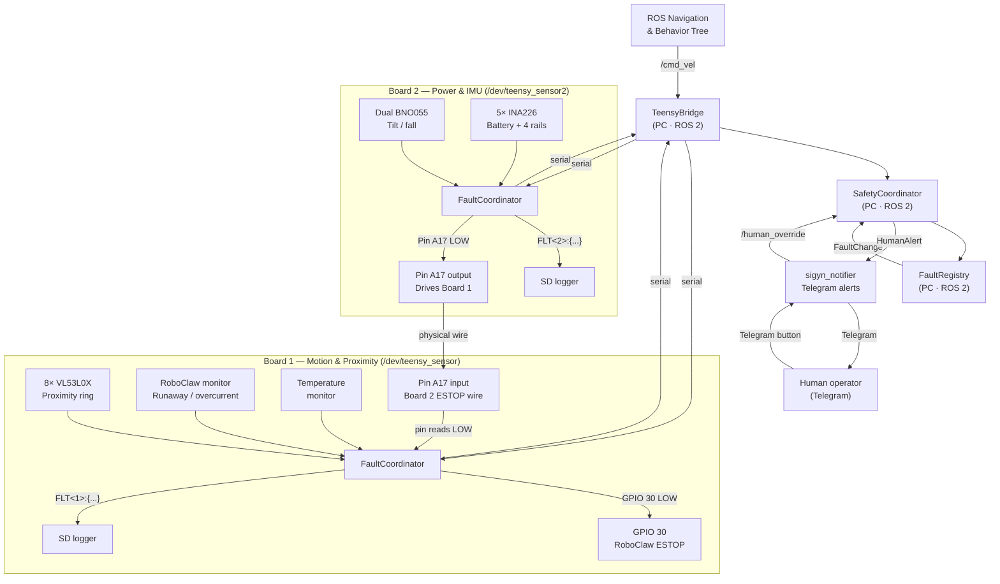
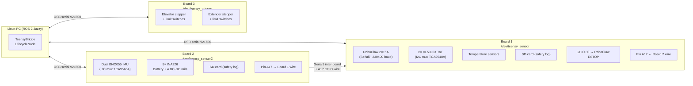
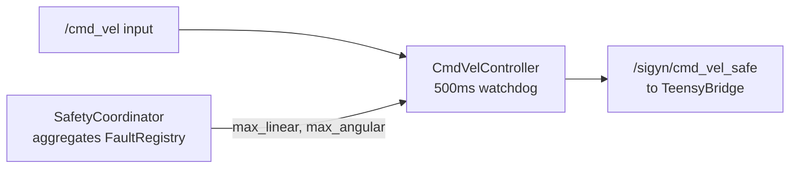
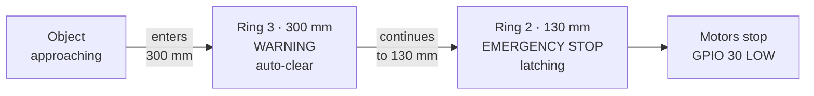
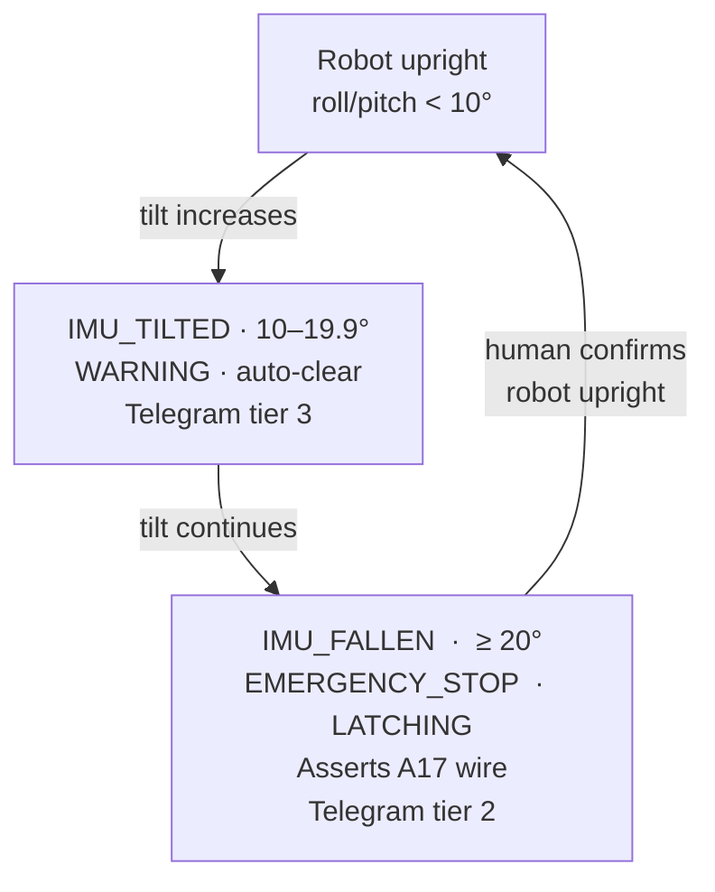
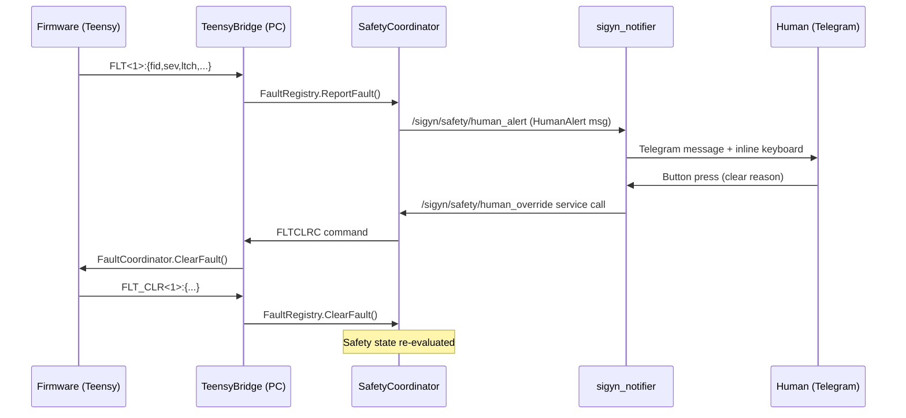

# Sigyn Safety System — Design Review

*Prepared 2026-03-30 · For discussion with roboticists in ~20 min*

---

## 1. What Is Sigyn, And Why Does Safety Matter?

Sigyn is a full-size autonomous assistive robot designed to operate indoors around people, furniture, and cluttered living spaces.  She is roughly 0.46 m in diameter, drives on differential wheels powered by a 36 V LiPo, and carries a vertical elevator with a gripper arm.  The primary use case is unattended autonomous patrol and object interaction — the robot may be operating in a room where people are present but not actively supervising it.

That operating context raises the bar for what "safe stopping" means:

- A software crash, USB drop, or serial timeout must not leave the motors running.
- A person who walks into the robot's path must be detected and stopped *before* contact.
- An unexpected tilt (near-fall, collision, getting snagged on a cord) must stop motion immediately.
- A nearly-dead battery must warn before the hardware protection dongle cuts 36 V with no warning.
- A human must be able to understand *why* the robot stopped, not just *that* it stopped.

The safety system described here is designed to answer: **if anything electrical, mechanical, or software goes wrong, how does the robot stop fast, stay stopped, tell a human why, and only restart when it is safe to do so?**

---

## 2. Architecture at a Glance

Sigyn uses **three Teensy 4.1 microcontrollers** plus a **Linux PC** running ROS 2 Jazzy.  Motion authority flows from the outside in; stop authority flows from the inside out.



### Key design choices

| Choice | Why |
|---|---|
| Firmware can stop motors without waiting for ROS | USB drop, Linux scheduling jitter, or a crashed ROS node must not leave the robot moving |
| Board 2 has a direct hardwired path to Board 1 | IMU fall detection or battery fault can assert ESTOP on the motion board with ~1 ms latency — no serial, no PC |
| Faults are named and instanced, not boolean | `VL53L0X_RING2` on sensor 3 is distinct from sensor 5; the human knows exactly which sensor fired |
| Latching vs. auto-clear is per fault class | Close-range intrusion latches because a person may still be there; transient overcurrent auto-clears |
| All boards log to SD card with ROS-time alignment | Post-mortem analysis after any incident is based on synchronized evidence, not guesswork |

---

## 3. Hardware: Three Boards, Three Roles



**Board 1** is required for any robot operation.  **Boards 2 and 3 are optional** — the robot can limp in degraded mode if they are absent, but Board-2 absence will trigger a `BOARD_LOST` fault and alert.

---

## 4. The Fault Model

Every board firmware runs a `FaultCoordinator`.  Every safety module on that board has an injected `IFaultReporter` interface.  When a module detects a problem it calls `ReportFault(module, fault_id, severity, auto_clear, reason, instance)`.

### 4.1 Severity levels

| Severity | Firmware Effect | ROS Effect |
|---|---|---|
| `WARNING` | Logged to SD; reported via serial | Notified; velocity limit unchanged |
| `CRITICAL` | Logged; reported | Velocity clamped to 50% |
| `EMERGENCY_STOP` | GPIO ESTOP asserted immediately; logged | Velocity forced to zero; HumanAlert published |
| `SYSTEM_SHUTDOWN` | (reserved) | — |

### 4.2 Auto-clear vs. latching

- **Auto-clear**: fault disappears when the underlying condition resolves (e.g. obstacle moves away, temperature drops, voltage recovers).
- **Latching**: fault stays active until a human explicitly acknowledges it via the Telegram interface or the `/sigyn/safety/human_override` ROS service.  Latching is used whenever the physical scene may still be unsafe even if the raw signal has cleared.

### 4.3 Fault identity

Each fault is keyed by `(board_id, fault_id, instance)` on both the Teensy and the PC side.  Instance lets the same fault class fire independently on different sensors: `VL53L0X_RING2` on sensor 3 is entirely separate from sensor 7.  The human override command must supply the correct `(board_id, fault_id, instance)` triple or the e-stop remains active.

### 4.4 Velocity authority chain (PC side)



`CmdVelController` also has an independent 500 ms watchdog: if no `/cmd_vel` message arrives for 500 ms the velocity output is zeroed, regardless of safety state.

---

## 5. Sensors and Fault Catalog

### 5.1 Proximity: 8× VL53L0X Time-of-Flight (Board 1)

Eight ST VL53L0X sensors are mounted around the robot periphery on a TCA9548A I²C multiplexer.  They form two concentric protection rings:



| Fault ID | Trigger | Severity | Recovery |
|---|---|---|---|
| `VL53L0X_RING3` | Object within 300 mm | WARNING | Auto-clear on exit (+50 mm hysteresis) |
| `VL53L0X_RING2` | Object within 130 mm | EMERGENCY_STOP | Latching — human must confirm obstacle cleared |

**Sensor positions** (instance → name):

| Inst | Name | Inst | Name |
|---|---|---|---|
| 0 | rear_right_bkwd | 4 | front_left_fwd |
| 1 | rear_right_side | 5 | front_left_side |
| 2 | front_right_side | 6 | rear_left_side |
| 3 | front_right_fwd | 7 | rear_left_bkwd |

The 130 mm inner threshold leaves ~15 mm clearance from the robot chassis edge — enough to stop before contact on a slow approach, but tighter than ideal.  **This is a good topic for discussion.**

---

### 5.2 Tilt and Fall: Dual BNO055 IMU (Board 2)

Two BNO055 9-DOF IMUs are connected via a second TCA9548A mux on Board 2.  **Only the front-right IMU (instance 1) is used for tilt safety decisions** — the rear-left (instance 0) provides redundant orientation data published to ROS.



Because Board 2 drives the A17 wire LOW when `IMU_FALLEN` fires, Board 1 cuts the motors **without going through USB serial** — the latency is constrained by the firmware loop period (~5 ms), not by Linux scheduling.

---

### 5.3 Battery and Power Rails: 5× INA226 (Board 2)

Five INA226 current+voltage sensors monitor the main battery and four DC-DC converters:

| Index | Rail | Nominal | Fault IDs |
|---|---|---|---|
| 0 | Main 36 V LiPo | 36 V | `BATT_LOW` (WARNING), `BATT_CRIT` (EMERGENCY_STOP) |
| 1 | 5 V DC-DC | 5 V | `RAIL_FAULT` |
| 2 | 12 V DC-DC | 12 V | `RAIL_FAULT` |
| 3 | 24 V DC-DC | 24 V | `RAIL_FAULT` |
| 4 | 3.3 V DC-DC | 3.3 V | `RAIL_FAULT` |

`sigyn_notifier` also watches the `/sigyn/power/battery` ROS topic independently and sends Telegram alerts at configurable voltage thresholds (default: warn at 22.5 V, critical at 21.0 V).  The hardware protection dongle typically cuts power around 19.8 V — these thresholds provide enough warning to return to a charging station.

Battery state uses an exponential moving average (EMA) filter on voltage and current, with a startup settling period to suppress spurious faults during board initialization.

---

### 5.4 Motor Safety: RoboClaw Monitor (Board 1)

The RoboClaw 2×15A differential drive controller is monitored continuously from Board 1 via Serial7.  One serial transaction per loop tick keeps latency deterministic.

| Fault ID | Trigger | Severity | Recovery |
|---|---|---|---|
| `RUNAWAY_M1`, `RUNAWAY_M2` | Motor moving when commanded stopped; speed ≥ threshold | EMERGENCY_STOP | Latching — requires human override |
| `HW_OVERCURR_M1`, `HW_OVERCURR_M2` | RoboClaw internal HW current fault bits set | EMERGENCY_STOP | Auto-clear |
| `SW_OVERCURR_M1`, `SW_OVERCURR_M2` | Software current threshold exceeded | EMERGENCY_STOP | Auto-clear |
| `RCLW_ERR` | Fatal RoboClaw error status bits | EMERGENCY_STOP | Auto-clear |
| `MOTOR_OVERTEMP` | Temperature threshold exceeded | EMERGENCY_STOP | Auto-clear |
| `MOTOR_COMM_FAIL` | Consecutive read failures ≥ 3 | EMERGENCY_STOP | Auto-clear after re-init |
| `SPIN_PLACE` | Anomalous in-place rotation detected | CRITICAL | Latching |

On initialization, `RoboClawMonitor::InitRoboClaw()` explicitly sends `SpeedAccelM1M2(addr, accel, 0, 0)` *after* PID configuration to prevent residual velocity commands from a previous session causing unintended motion at startup.

---

### 5.5 Hardwired Inter-Board E-Stop

This is the most important redundancy path in the system:

```
Board 2, Pin A17 (OUTPUT) ─────────── Board 1, Pin A17 (INPUT_PULLUP)
  HIGH = no e-stop                               reads HIGH = safe
  LOW  = e-stop asserted                         reads LOW  = cut motors
```

- Idle-HIGH convention: disconnected cable or powered-off Board 2 reads as **safe** on Board 1 (fail-safe direction).
- Board 2 drives LOW when `IMU_FALLEN` or `BATT_CRIT` triggers `EStopPin::SetEstopPin(true)`.
- Board 1 polls the pin every loop tick; a HIGH→LOW transition immediately runs `FaultCoordinator::ReportFault(ESTOP_ASSERTED, EMERGENCY_STOP)` and drives GPIO 30 LOW.
- On first connection, Board 1 runs a **self-test**: sends `ESTOP_TEST_ASSERT` over the inter-board serial, waits up to 100 ms for the pin to read LOW, then sends `ESTOP_TEST_RELEASE`.  A failure generates an ERROR DIAG surfaced as a fault — so a broken cable is detected at startup, not after a fall.

---

### 5.6 Communication Watchdog and Protocol Versioning

Both boards send `HB<N>:{t:...}` heartbeat messages.  If the PC side misses heartbeats for a configurable period it marks the board as lost and triggers `BOARD_LOST` (EMERGENCY_STOP, tier 2 Telegram alert).

Both ends compile in `WR_PROTO_MSGS_VERSION` from `wr_proto_msgs/version.h`.  During connect, both sides exchange version strings (`PROTO` / `PROTO_REQ` / `PROTO_ACK`).  A version mismatch → `PROTO_VER_MISMATCH` fault → safe mode.  This prevents stale firmware from silently misbehaving after a partial update.

---

## 6. Human-in-the-Loop: Notification and Override



`sigyn_notifier` is a Python ROS 2 node that bridges the `HumanAlert` topic to a Telegram bot.  The bot sends a message with inline buttons labeled with the permitted clear reasons (e.g. "obstacle_removed", "robot_upright").  When the operator presses a button, the notifier calls the `/sigyn/safety/human_override` service with the correct `(board_id, fault_id, instance, reason)` — exactly matching what the firmware needs to release the latch.

**Escalation**: if no human response arrives within the configured timeout (30 s for `IMU_FALLEN`, 600 s for `VL53L0X_RING2`), the notifier escalates to a higher-priority contact tier.

---

## 7. Observability: SD Logging and Time Alignment

Every fault, fault-clear, and DIAG message is written to the SD card on the board where it originated, timestamped with the board's `millis()` clock.  On connect, `TeensyBridge` records the `(ros_time, teensy_millis)` pair from the `PROTO` announce message.  This offset is used to convert any subsequent Teensy timestamp to a ROS time, making cross-board log reconstruction possible after an incident.

The result is that a post-mortem can answer:

- Which sensor fired first?
- Did the inter-board wire assert before or after the serial fault message arrived at the PC?
- What was the battery voltage at the time of the fall?
- Was the `cmd_vel` watchdog already in effect before the ESTOP?

---

## 8. Test Coverage

| Test suite | Location | Tests | What it covers |
|---|---|---|---|
| `test_roboclaw_monitor` | wr_teensy_boards | 15 | Runaway, overcurrent, comm-fail, ESTOP paths |
| `test_estop_pin` | wr_teensy_boards | 22 | Assert/release, Board 1/2, codec |
| `test_fault_coordinator` | wr_teensy_boards | 17 | State machine, instance isolation |
| `test_vl53l0x_monitor` | wr_teensy_boards | 32 | Ring transitions, hysteresis, per-sensor independence |
| `test_bno055_tilt` | wr_teensy_boards | 13 | Quaternion→roll/pitch, tilt state classification |
| `test_battery_monitor` | wr_teensy_boards | 30 | SoC estimation, EMA, channel classification |
| `test_fault_registry` | wr_ros_teensy | 13 | Report/clear/latch/aggregate severity |
| `test_safety_coordinator` | wr_ros_teensy | 3 | Authority chain NORMAL/DEGRADED/ESTOP |
| `test_cmd_vel_controller` | wr_ros_teensy | 8 | Passthrough, DEGRADED clamp, ESTOP zero, watchdog |
| **Total** | — | **228 (firmware) + 140 (ROS)** | All passing as of 2026-03-31 |

All firmware tests are pure-function native tests (no hardware, no simulator) run via PlatformIO.

---

## 9. Known Gaps — Good Topics for Discussion

| Gap | Impact | Notes |
|---|---|---|
| VL53L0X 130 mm inner ring | ~15 mm chassis clearance — may be too tight for fast approaches | Changing requires odometry + stop-distance analysis |
| Only one IMU used for tilt safety | Instance 0 (rear-left) is passive — not a redundant tilt path | Adding dual-IMU voting would strengthen this |
| Some firmware modules not yet unit-testable | `FaultCoordinator`, `Heartbeat`, `ProtocolAgreement` — blocked by singleton web | Refactor plan documented in `AI_CONTEXT.md` Section 9 |
| `MOTOR_OVERTEMP` auto-clears | If a thermal problem is intermittent, repeated auto-clears could mask a real hazard | Consider counting auto-clear cycles and escalating |
| No fault injection test campaign | System-level behaviour under combinations of simultaneous faults is untested | Important for any safety-critical use case |
| Telegram is not guaranteed-delivery | If the bot is unreachable, human alerts silently fail | Local fallback (LED, buzzer, ROS `/diagnostics`) would help |
| The ESTOP cable self-test only runs at startup | A cable that fails mid-operation goes undetected until next reboot | Periodic cable integrity check would catch this |

---

## 10. Repository Map

| Repo | Language | Role |
|---|---|---|
| `wimblerobotics/wr_teensy_boards` | C++17 (PlatformIO) | Firmware for all three Teensy boards |
| `wimblerobotics/wr_ros_teensy` | C++ (ROS 2 Jazzy) | PC-side bridge, FaultRegistry, SafetyCoordinator, CmdVelController |
| `wimblerobotics/wr_proto_msgs` | C++ header-only | Shared serial protocol types and version stamp |
| `wimblerobotics/sigyn_notifier` | Python (ROS 2) | Telegram notification + human-override bridge |
| `wimblerobotics/wr_interfaces` | ROS 2 msgs/srvs | `SafetyState`, `HumanAlert`, `HumanOverride`, `ClearFault`, etc. |
