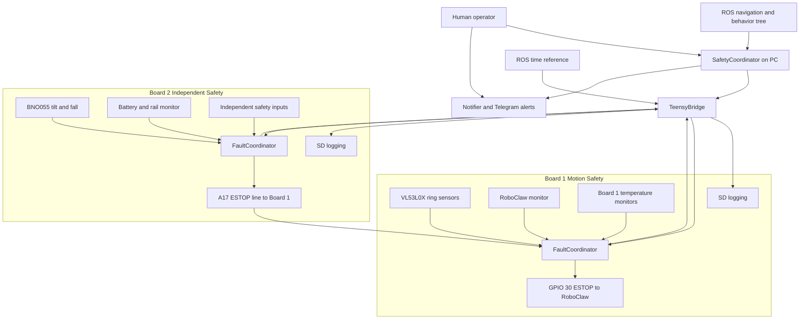
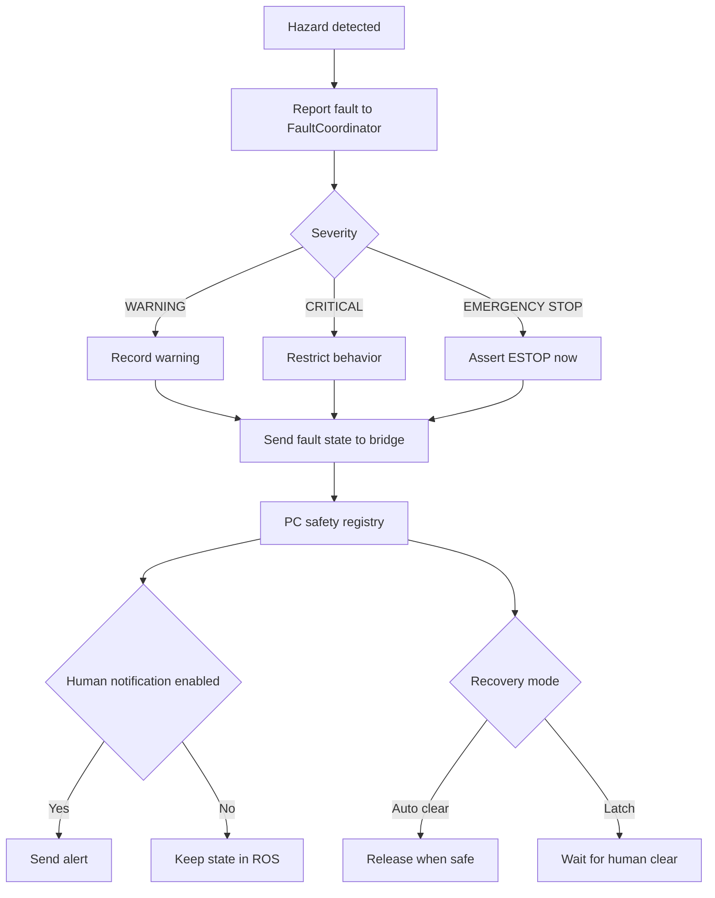
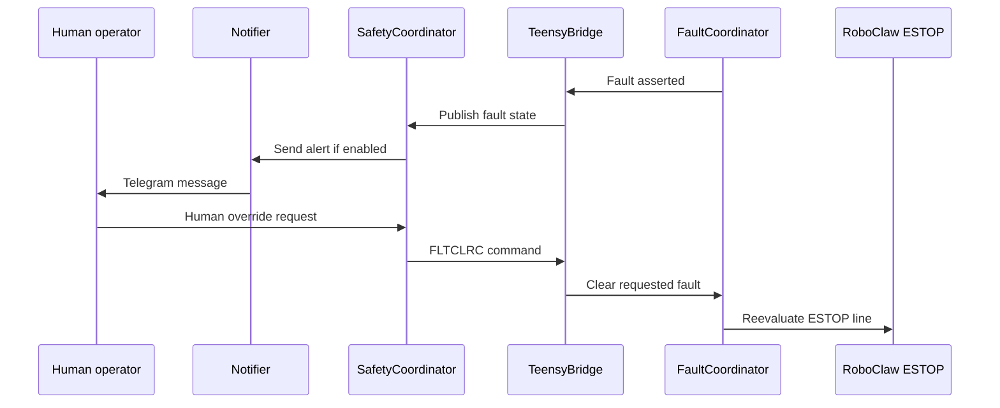

# Sigyn Safety System Review

> Sigyn's safety system is built around a simple idea: stopping should be local, fast, and explainable. Board 1 owns the main drive stop path, Board 2 contributes independent sensing and a hardwired ESTOP assertion path, the PC aggregates state and controls recovery policy, and all boards log enough detail to support post mortem analysis against ROS time. What I want feedback on tonight is whether the fault semantics, redundancy, logging, and recovery model are strong enough for an assistive robot operating around people, and where the design is still too optimistic.

## 1. Motivation And Design Target

Sigyn is an autonomous assistive robot intended to operate around people, furniture, and cluttered indoor spaces. That changes the standard for what counts as an acceptable failure response.

The safety system is trying to answer one practical question:

> If sensing, software, communications, or actuation go wrong, how does the robot stop in a way that is fast, predictable, diagnosable, and understandable to a human?

### Core safety goals

- Stop motion quickly when the robot gets too close to a person or obstacle.
- Stop motion if the drive system behaves differently from what the PC commanded.
- Stop motion if the robot tips, falls, overheats, or loses confidence in key power or motion hardware.
- Make it obvious to a human why the robot stopped.
- Require human acknowledgement for faults that imply the physical scene may still be unsafe.
- Allow self-healing for faults that are transient and safe to recover from automatically.
- Preserve enough detail to reconstruct what happened after a fault or near miss.
- Preserve time-aligned logs across boards and ROS so post mortem analysis is based on evidence rather than guesswork.

### Operating assumptions

- People may be near the robot when a fault occurs.
- The ROS PC cannot be the only safety layer.
- Sensors can be noisy, partially wrong, or temporarily unavailable.
- Not every abnormal condition deserves the same response.
- False positives matter because nuisance stops reduce operator trust and invite unsafe workarounds.

### Non-goals

- This is not a certified functional safety system.
- It is not proof against every single-point failure.
- It does not yet provide a formally safety-rated independent controller.

Even with those limits, the design is aiming in the right direction for a human-adjacent robot: layered sensing, firmware-level stop authority, explicit fault semantics, and strong observability.

---

## 2. Safety Philosophy

The current design rests on six principles.

| Principle | What it means on Sigyn | Why it matters |
|---|---|---|
| Hardware-fast before software-smart | Teensy firmware can assert stop paths without waiting for Linux or ROS | The fastest stop path should not depend on USB, scheduling, or ROS health |
| Layered detection | Proximity, tilt, battery, rails, temperature, motor behavior, and communications each have their own fault paths | A single missed detector should not be the only barrier |
| Severity-based response | WARNING, CRITICAL, and EMERGENCY_STOP have different operational consequences | Not every abnormal condition deserves the same recovery policy |
| Human acknowledgement for scene-safety faults | Some faults stay latched until a person explicitly clears them | If the scene may still be dangerous, software should not silently recover |
| Preserve diagnosability | Fault IDs, board IDs, and instances are propagated upward | A safe stop is less useful if nobody can explain what triggered it |
| Preserve forensic evidence | All boards log locally and can align timestamps to real-world ROS time | Review and improvement depend on being able to reconstruct fault order |

In one sentence: the design prefers stopping too early over moving under uncertainty, but it tries not to collapse all faults into one blunt “everything is the same” response.

---

## 3. High-Level Architecture

### What this gets right

- The robot can stop at firmware level without waiting for ROS.
- Board 2 has a direct physical path to force Board 1 into ESTOP.
- Board 2 is doing real safety sensing, not just acting as a relay.
- Board 1 includes dedicated temperature monitoring in addition to RoboClaw-side fault detection.
- Fault information is promoted upward into ROS for policy and human visibility.
- All boards maintain local logs, improving post mortem analysis beyond what ROS logs alone can provide.

### Main architectural concern

The strongest part of the design is the local stop path. The weakest part is that overall safety still depends on several non-certified components cooperating correctly: multiple microcontrollers, USB links, Linux, ROS services, and notification policy. That is reasonable for a serious research platform, but it is still the main gap between this design and a production assistive robot safety architecture.

---

## 4. The Most Important Review Judgments

These are the areas most worth pressure-testing in a group review.

### A. Is the stop path independent enough from the PC?

Current answer: mostly yes for immediate drive stop, not fully yes for all system-level safety conclusions.

### B. Are latching faults chosen appropriately?

Current answer: mostly yes. Close-range intrusion and fallen-robot cases latch, which matches the idea that the physical scene must be rechecked by a human before motion resumes.

### C. Are any self-clearing faults too optimistic?

Current answer: maybe. Overcurrent, thermal, and some communication faults auto-clear. That helps recoverability, but reviewers should ask whether recurrent self-healing could hide a hazardous intermittent problem.

### D. Is Board 2 independent enough to count as meaningful redundancy?

Current answer: stronger than a simple backup ESTOP line because it carries BNO055 and battery or rail monitoring. Still, it is worth challenging how much shared infrastructure remains.

### E. Does the system fail safe when subsystems disappear?

Current answer: unevenly. Some losses halt motion or assert direct stop paths, but some sensor-loss cases still degrade into uncertainty rather than explicit proof the scene is safe.

### F. Is the post mortem evidence strong enough?

Current answer: stronger than most prototype robots. All boards log locally to SD card, and timestamps can be aligned to real-world ROS time. That makes cross-board reconstruction possible after faults, near misses, and strange intermittent behaviors.

---

## 5. Discussion Questions For Tonight

1. Is the split between WARNING, CRITICAL, and EMERGENCY_STOP meaningful enough, or are some categories still operationally ambiguous?
2. Which faults should always require human acknowledgement before motion can resume?
3. Which auto-clear faults should escalate if they recur within a short time window?
4. Is Board 2 independent enough to count as a credible secondary safety board?
5. Should loss of specific sensors be treated more aggressively than it is now?
6. Is Telegram an acceptable human notification channel for this stage, or does it create false confidence?
7. Are any current temperature, current, or power recovery policies too permissive for an assistive robot near people?
8. Is the SD-card logging and ROS-time synchronization detailed enough to support credible post mortem analysis?
9. What evidence would reviewers want before trusting this robot for more unsupervised household operation?

---

## 6. Post Mortem Logging And Time Synchronization

An important part of the safety story is not just stopping the robot, but being able to explain later what happened, in what order, and why.

All boards include detailed SD-card logging. Those logs can be synchronized to real-world ROS time, allowing firmware events, ROS messages, operator actions, and higher-level behavior transitions to be correlated on one timeline.

Why this matters:

- It becomes possible to distinguish root cause from downstream cascade.
- Reviewers can ask not only “did it stop?” but also “what happened in the 5 seconds before the stop?”
- Cross-board timing can be reconstructed instead of inferred.
- Fault analysis becomes much more credible after intermittent or hard-to-reproduce events.

This is a meaningful strength of the design. Many prototype robots can stop; far fewer can support a serious evidence-based post mortem.

---

## 7. Mid-Level Design: Who Does What?

| Component | Primary responsibility | Safety role |
|---|---|---|
| Board 1 Teensy | Monitors proximity, motion-adjacent faults, and board temperature; controls RoboClaw ESTOP | Main real-time drive stop authority |
| Board 2 Teensy | Monitors tilt, battery, rail health, and other independent safety inputs; can assert ESTOP to Board 1 | Secondary fast stop path plus independent sensing |
| FaultCoordinator | Aggregates local firmware faults and maps them to ESTOP behavior | Local fault state machine |
| RoboClawMonitor | Detects runaway, current, internal error, and motor-controller faults | Actuator-side hazard detection |
| Board 1 temperature monitors | Detect board thermal problems beyond the motor controller's own reporting | Additional thermal protection layer |
| VL53L0X monitor | Detects proximity ring incursions | Human and obstacle protection layer |
| Battery and rail monitor on Board 2 | Detects low battery and rail anomalies | Power integrity protection |
| BNO055 monitor on Board 2 | Detects tilt and fallen states | Tip-over protection |
| TeensyBridge | Moves board state and fault state between firmware and ROS | Communication and observability bridge, not the primary stop path |
| SafetyCoordinator | Aggregates safety state on the PC, exposes services, handles board loss, publishes faults | Policy, observability, and operator interface |
| sigyn_notifier | Sends human-facing Telegram alerts | Human response layer |
| Per-board SD logging | Records detailed local events with time alignment to ROS | Post mortem analysis and cross-layer debugging |

### Command gating model

Motion is not allowed just because navigation wants it.

- Firmware can hold ESTOP asserted even if the PC is healthy.
- The PC can refuse to continue motion when board-level safety state is bad.
- A human can be required to acknowledge a latched fault before firmware releases motion.

That is the correct direction for a human-adjacent robot: motion should require agreement from several layers, while stopping should require only one credible detector.

---

## 8. End-To-End Fault Lifecycle

### Key interpretation

- Detection is distributed.
- Stop authority is local.
- Explanation and coordination are centralized.
- Recovery depends on fault class, not just on whether the raw signal flickers clear.

That separation is sensible because “stop now” and “understand what happened” have different timing requirements.

---

## 9. Fault Classes And Recovery Semantics

### Severity meaning

| Severity | Operational meaning | Expected robot behavior |
|---|---|---|
| WARNING | Something is abnormal but not yet clearly dangerous | Continue cautiously or adapt behavior |
| CRITICAL | Continued autonomy should not be trusted | Halt or heavily restrict behavior |
| EMERGENCY_STOP | Immediate stop path should assert | Motors stop now |

### Recovery meaning

| Recovery mode | Meaning | Example use |
|---|---|---|
| Auto-clear | Fault disappears when the underlying condition becomes safe again | Temporary overcurrent or transient rail issue |
| Latching | Fault remains active until explicit human acknowledgement | Close-range intrusion or fallen robot |

### Review concern

The model is strong, but its safety value depends entirely on how disciplined the severity and recovery assignments are. That is one of the best places for outside reviewers to challenge the design.

---

## 10. Low-Level Fault Catalog

This section is intentionally detailed so the review can drill down into specific choices.

### 10.1 Proximity Rings: VL53L0X Array On Board 1

The robot uses multiple VL53L0X sensors arranged as protection rings.

| Fault | Trigger | Severity | Recovery |
|---|---|---|---|
| `VL53L0X_RING3` | Outer caution band breached | WARNING | Auto-clear |
| `VL53L0X_RING2` | Inner protection band breached | EMERGENCY_STOP | Human override required |

Why this is good:

- It distinguishes “be careful” from “stop now.”
- It preserves sensor instance information so the operator can understand where the intrusion occurred.
- Ring-2 latching matches the idea that a person may still be within contact range even if the sensor briefly reads clear.

What to challenge:

- Is a two-ring model enough, or should there be a stronger intermediate slow-down layer?
- How trustworthy are the sensors around reflective surfaces, cloth, sunlight, and angled furniture?

### 10.2 RoboClaw And Drive Faults On Board 1

The motor controller path is one of the most important parts of the system because it is where unexpected motion becomes physically dangerous.

Board 1 also includes temperature monitoring beyond the RoboClaw's own internal reporting, so the motion-safety board has an additional thermal detection path.

| Fault | Trigger | Severity | Recovery |
|---|---|---|---|
| `RUNAWAY_M1`, `RUNAWAY_M2` | Motor movement inconsistent with commanded stop or expected state | EMERGENCY_STOP | Latching human override |
| `HW_OVERCURR_M1`, `HW_OVERCURR_M2` | RoboClaw internal current fault bits | EMERGENCY_STOP | Auto-clear |
| `SW_OVERCURR_M1`, `SW_OVERCURR_M2` | Software current threshold exceeded | EMERGENCY_STOP | Auto-clear |
| `RCLW_ERR` | Fatal RoboClaw error bits | EMERGENCY_STOP | Auto-clear |
| `MOTOR_OVERTEMP` | Temperature exceeds configured threshold | EMERGENCY_STOP | Auto-clear |
| `MOTOR_COMM_FAIL` | Too many failed motor-controller reads | EMERGENCY_STOP | Auto-clear after re-init |

Why this is good:

- Runaway is treated differently from overload, which is correct.
- Faults are per motor where appropriate, so the operator gets useful detail.
- ESTOP output is tied directly to local fault coordination rather than depending on ROS.

What to challenge:

- Should repeated auto-clearing overcurrent faults escalate to latching after $N$ events in a time window?
- Should some communication failures latch if they occur while the robot is actively moving?
- Should board-level temperature faults have recurrence or time-above-threshold escalation?

### 10.3 Battery And Power Rails On Board 2

These monitors live on Board 2, not Board 1. That matters architecturally because the secondary safety board is performing substantive sensing, not just carrying a backup ESTOP path.

| Fault | Meaning | Current severity | Recovery |
|---|---|---|---|
| `BATT_CRIT` | 36 V pack critically low | EMERGENCY_STOP | Auto-clear |
| `BATT_LOW` | 36 V pack low warning | WARNING | Auto-clear |
| `POWER_RAIL_5V` | 5 V rail out of expected range | WARNING for now | Auto-clear |
| `POWER_RAIL_12V` | 12 V rail out of expected range | WARNING for now | Auto-clear |
| `POWER_RAIL_24V` | 24 V rail out of expected range | WARNING for now | Auto-clear |
| `POWER_RAIL_3V3` | 3.3 V rail out of expected range | WARNING for now | Auto-clear |

Why this is good:

- The architecture already makes power integrity part of the safety conversation.
- Board 2 contributes meaningful independent observability.
- Severities are conservative while sensor trust is still being validated.

What to challenge:

- Some rails may deserve stronger severities once the sensing path is better characterized.
- If 3.3 V or 24 V integrity is truly suspect, should the robot be allowed to keep moving at all?

### 10.4 Tilt And Fallen Robot On Board 2

The BNO055 tilt and fall logic also lives on Board 2.

| Fault | Trigger | Severity | Recovery |
|---|---|---|---|
| `IMU_TILTED` | Roll or pitch exceeds warning threshold | WARNING | Auto-clear when upright |
| `IMU_FALLEN` | Roll or pitch exceeds critical threshold | EMERGENCY_STOP | Latching human override |

Why this is good:

- The distinction between “tilted” and “fallen” is practical.
- Fallen-robot latching is the right default for a system that could otherwise move while tipped or entangled.

What to challenge:

- Is a single IMU enough for confidence here?
- Are the thresholds validated on real flooring, rugs, ramps, thresholds, and manual handling conditions?

### 10.5 Board Heartbeat Loss On The PC Side

| Fault | Trigger | Severity | Recovery |
|---|---|---|---|
| `BOARD_LOST` | Expected board heartbeat not received on time | CRITICAL | Clears when board returns |

Why this is good:

- The PC does not silently continue as if the board were healthy.
- Higher-level motion behavior can be halted quickly.

What to challenge:

- Is CRITICAL strong enough for every board, or should some board losses imply stronger action?
- What should happen if the missing board is the one carrying the most important active safety sensing?

---

## 11. Human Override And Notification Model

### Why this is useful

- Human acknowledgement is explicit.
- The cleared fault retains its identity through the whole path.
- Board ID and instance can be preserved so the right condition is actually cleared.

### Why this deserves scrutiny

- Human override is only as good as the operator's understanding of the fault.
- Telegram is convenient, but it is not a guaranteed-delivery safety interface.
- If the recovery workflow is too easy, operators may click through stops they should physically inspect.

This is one of the best sections for blunt feedback in a meeting: would other roboticists trust the current human-in-the-loop recovery model?

---

## 12. Verification Status

### Current strengths

- The embedded safety logic is structured around small interfaces and is reasonably testable.
- PlatformIO native unit tests cover the major firmware safety modules.
- ROS-side tests cover important `FaultRegistry` and `SafetyCoordinator` behavior.
- The protocol and fault vocabulary are explicit rather than ad hoc.
- Per-board SD logging and time alignment materially improve fault investigation quality.

### Current limitations

- There is still a large gap between unit-tested behavior and system-level proof under real timing and failure conditions.
- Notification policy is partly configured in JSON, which is flexible but can drift from implementation assumptions.
- There is no formal fault-injection campaign across combinations of failures.
- There is no independent safety-rated controller or certified safety channel.
- The logging story is strong, but timestamp accuracy and log completeness under brownout, reset, and crash conditions still need explicit validation.

### Tests that exist today

- Firmware: `test_fault_coordinator`, `test_roboclaw_monitor`, `test_vl53l0x_monitor`, `test_estop_pin`, `test_bno055_tilt`, `test_battery_monitor`
- ROS: `test_fault_registry`, `test_safety_coordinator`

### Tests I would want next

1. End-to-end fault injection with the robot mechanically constrained and motors enabled.
2. Repeated-fault escalation tests for intermittent overcurrent, overheating, and communication failures.
3. Board-loss and reconnect tests while the robot is actively moving.
4. Sensor-trust characterization for VL53L0X, IMU, temperature, and rail monitors in realistic home conditions.
5. Logging validation that proves timestamp alignment and log completeness through resets and abnormal shutdowns.
6. Operator workflow tests to verify that notifications are understandable and not spammy.

---

## 13. My Candid Assessment

If this were presented in a robotics review, I would describe it this way.

### What is designed well

- The architecture clearly understands that safety cannot be a ROS-only feature.
- The firmware-side stop path is the strongest part of the design.
- Board 2 is doing real safety sensing, not merely duplicating a stop wire.
- Faults are named, structured, and propagated with unusually good diagnosability for a research robot.
- Latching is used where physical scene risk is likely to remain after the trigger disappears.
- SD-card logging with ROS-time synchronization makes post mortem analysis much more credible than in a typical prototype.

### Where the main gaps remain

- The system is still a best-effort engineered safety stack, not a formally safety-rated one.
- Some auto-clear policies may still be too optimistic for an assistive robot operating near people.
- Heartbeat loss and sensor loss semantics are not yet equally strong across all failure modes.
- Notification and override ergonomics are practical, but not yet robust enough to assume operator behavior will always be correct.
- System-level validation is not yet as strong as the component-level structure.

### Overall judgment

For a serious prototype or advanced research platform, this is a thoughtful and above-average safety architecture. It shows the right instincts: layered stops, local fault authority, independent sensing on multiple boards, human-visible state, and evidence-preserving logging.

For a robot that would routinely operate around vulnerable people without direct supervision, the next step is not just more features. The next step is more proof: better fault injection, better degraded-mode reasoning, stronger sensor-loss handling, and stronger validation that the logging and recovery model work correctly under the ugliest failure modes.

---

## 14. Recommended Review Outcomes

If tonight's meeting goes well, the most useful outcomes would be:

1. Agreement on which faults must always latch.
2. Agreement on which auto-clear faults need recurrence escalation.
3. Agreement on whether Board 2 is independent enough, or what would make it meaningfully more independent.
4. Agreement on what logging evidence reviewers would require after a near miss or strange stop event.
5. A shortlist of the missing system-level tests needed before higher-trust deployment.
6. A decision on whether the notification and override workflow is acceptable as-is for the current stage.

---

## 15. Pointers To Implementation

For anyone who wants to go from design discussion into code, these are the main anchors.

- Firmware fault state machine: `wr_teensy_boards/common/fault_coordinator.h` and `wr_teensy_boards/common/fault_coordinator.cpp`
- Board 1 ESTOP and drive monitoring: `wr_teensy_boards/modules/roboclaw/roboclaw_monitor.h` and `wr_teensy_boards/modules/roboclaw/roboclaw_monitor.cpp`
- Board 1 proximity sensing: `wr_teensy_boards/modules/vl53l0x/`
- Board 1 temperature monitoring: board-level temperature monitor sources in `wr_teensy_boards/modules/`
- Board 2 ESTOP input path: `wr_teensy_boards/modules/estop_pin/estop_pin.h` and `wr_teensy_boards/modules/estop_pin/estop_pin.cpp`
- Board 2 IMU monitoring: `wr_teensy_boards/modules/bno055/`
- Board 2 battery and rail monitoring: `wr_teensy_boards/modules/battery/`
- PC coordination: `wr_ros_teensy/src/SafetyCoordinator.cpp`
- PC fault registry: `wr_ros_teensy/src/FaultRegistry.cpp`
- Human notifications: `sigyn_notifier/sigyn_notifier/notifier_node.py`
- Interface definitions: `wr_interfaces/msg` and `wr_interfaces/srv`
- Existing implementation-heavy reference: [SAFETY_SYSTEM.md](/home/ros/sigyn_ws/src/Sigyn/docs/SAFETY_SYSTEM.md)

---
