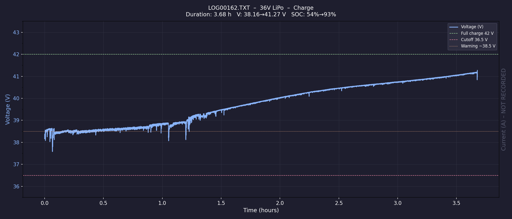
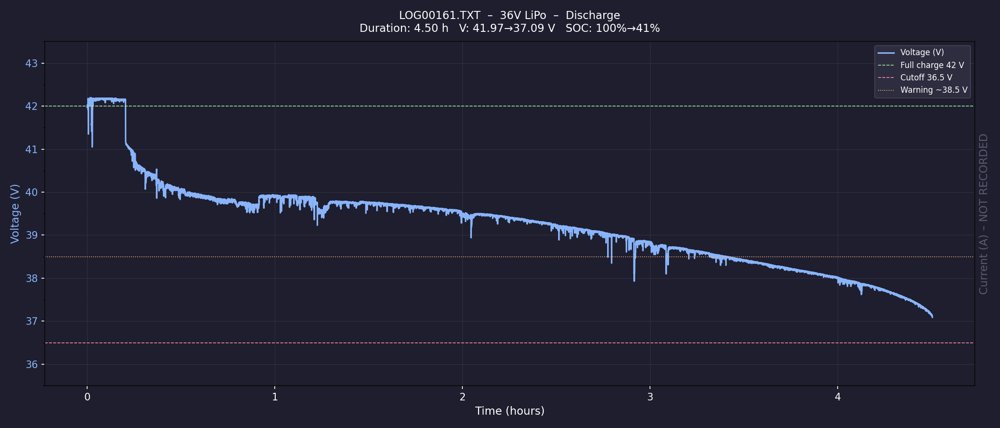
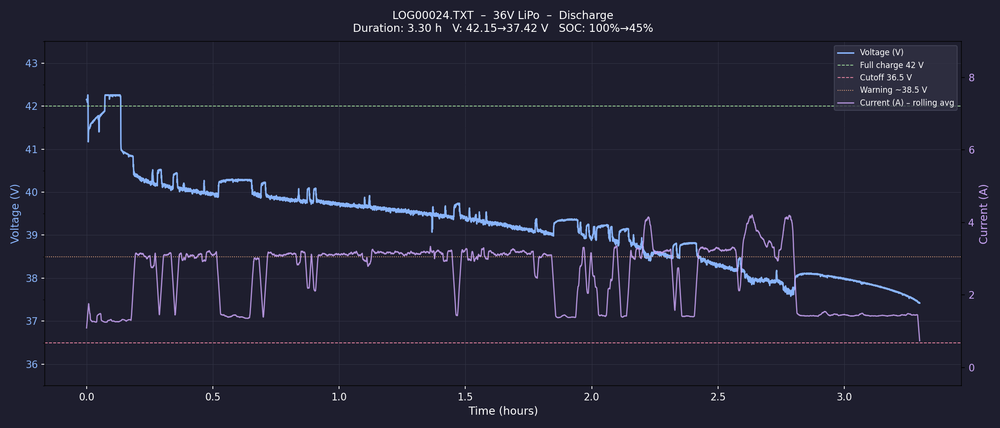
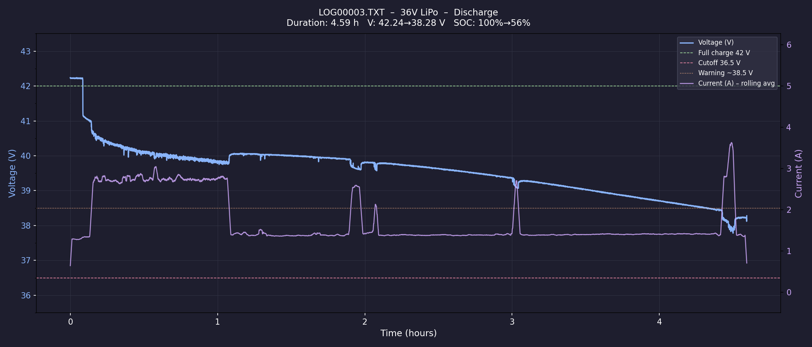
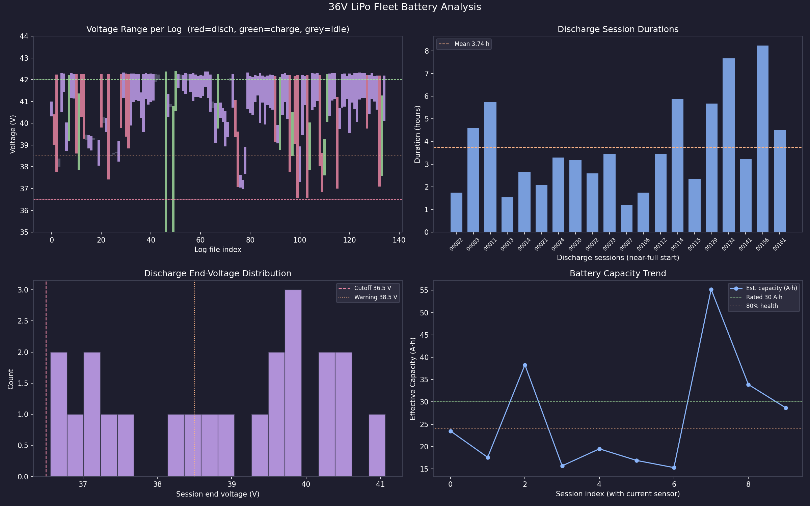

# Sigyn 36V LiPo Battery Analysis
## Log Set: `~/board2Logs/20260224/` (164 files, Board-2)

**Date of analysis:** February 24, 2026  
**Analyst:** GitHub Copilot  
**Battery:** 10-cell (10S) LiPo, 36V nominal, 30 Ah rated  
**Sensor board:** Board-2 (Power_Sensors), INA226 × 5 via TCA9548A I²C mux

---

## Table of Contents

1. [Executive Summary](#1-executive-summary)
2. [Session Under Study: LOG00162](#2-session-under-study-log00162)
3. [Preceding Discharge: LOG00161](#3-preceding-discharge-log00161)
4. [Current Sensor Problem — INA226 Calibration Bug](#4-current-sensor-problem--ina226-calibration-bug)
5. [Fleet Statistics — 164 Log Files](#5-fleet-statistics--164-log-files)
6. [Battery Health Assessment](#6-battery-health-assessment)
7. [Charging Time Analysis](#7-charging-time-analysis)
8. [BMS / Undervoltage Cutoff (36.5 V)](#8-bms--undervoltage-cutoff-365-v)
9. [Behavior Tree Thresholds](#9-behavior-tree-thresholds)
10. [Sensing & Logging Improvement Suggestions](#10-sensing--logging-improvement-suggestions)
11. [Additional Observations for the Robot Designer](#11-additional-observations-for-the-robot-designer)
12. [Scripts Reference](#12-scripts-reference)

---

## 1. Executive Summary

| Question | Answer |
|----------|--------|
| Full charge voltage | **42.2–42.4 V** (4.22–4.24 V/cell) |
| BMS / cutoff voltage | **36.5 V** — well chosen; observed minimum was 36.56 V |
| Average discharge current (working sensor) | **1.87 A** avg, 0.8–6.4 A range |
| Effective pack capacity | **~21.5 Ah** (72% of 30 Ah rated) |
| Typical run time from full charge to cutoff | **3.5 hours average** (range 0.75 – 8.25 h) |
| Estimated full charge time from cutoff | **~5.5 h** at ~4 A charger; **~3.5 h** at ~6 A |
| Current sensor status | **BROKEN since LOG00072** — firmware INA226 calibration bug |

> **LOG00162 is a charging session, not a discharge.** It starts at 38.2 V (~54% SOC) and rises to 41.3 V over 3.68 hours. The discharge that depleted the battery before LOG00162 is **LOG00161** (42.0 V → 37.1 V, 4.5 h).

---

## 2. Session Under Study: LOG00162

| Field | Value |
|-------|-------|
| Cycle type | **CHARGE** (voltage rising) |
| Duration | 3.68 h (13,239 s) |
| Start voltage | 38.16 V (54% SOC) |
| End voltage | 41.27 V (93% SOC) |
| Readings | 13,218 |
| Current sensor | Not reporting (A = 0.00 throughout) |

**LOG00162 is a partial-recharge session.** The charger was connected after the preceding discharge (LOG00161) and ran for ~3.7 hours, recovering about 39% of SOC (54% → 93%) before the system was shut off or the log ended. The battery was not brought to full charge (42.2 V) in this session.

### Plot — LOG00162 Voltage Profile



---

## 3. Preceding Discharge: LOG00161

LOG00161 is the discharge session that immediately preceded LOG00162.

| Field | Value |
|-------|-------|
| Cycle type | **DISCHARGE** |
| Duration | 4.50 h (16,213 s) |
| Start voltage | 41.97 V (99.7% SOC) |
| End voltage | 37.09 V (41% SOC) |
| Voltage minimum | 37.09 V |
| SOC consumed | ~59% |
| Est. avg current | 3.90 A (voltage-drop estimate, 30 Ah basis) |
| Est. Ah consumed | 17.6 Ah |

The battery went from full charge down to 37.1 V (~41% SOC) over 4.5 hours before the session ended. The robot was not driven to the BMS cutoff; it stopped at moderate SOC, then the charger was connected (LOG00162).

### Plot — LOG00161 Voltage Profile



---

## 4. Current Sensor Problem — INA226 Calibration Bug

### Finding

**All five INA226 sensors stopped reporting current simultaneously between LOG00071 and LOG00072.**

| Log | Firmware Compiled | A readings |
|-----|-------------------|-----------|
| LOG00071 | Jan 5 2026 **16:10:12** | Non-zero (e.g. 1.80–1.90 A) ✅ |
| LOG00072 | Jan 5 2026 **23:26:54** | All zero (0.00 A) ❌ |

The firmware was recompiled ~7 hours later and broke current reading on **all** five monitored rails simultaneously (36VLIPO, 5VDCDC, 12VDCDC, 24VDCDC, 3.3VDCDC). This is strong evidence of a **firmware change bug, not a hardware failure**.

### Root Cause Analysis

The INA226 has a `CALIBRATION` register (register `0x05`) that must be programmed with a value calculated from the shunt resistor value and the desired current LSB:

```
CAL = 0.00512 / (current_LSB × R_shunt)
```

When `CAL = 0`, the `CURRENT` register (0x04) and `POWER` register (0x03) always return **zero**, regardless of actual shunt current. This is exactly the symptom observed.

**Likely cause:** A code refactor or cleanup in the Jan 5 23:26 firmware accidentally removed, moved, or conditioned-out the call that writes the CALIBRATION register on startup.

### How to Verify

In the Board-2 firmware source, look for:
```cpp
writeRegister(INA226_REG_CALIBRATION, calibrationValue);
// or equivalent: ina226.setCalibration(...)
```

Confirm this runs during `BatteryMonitor::init()` or equivalent. If it was inside an `#ifdef`, a conditional block, or removed during refactoring — that's the bug.

### Is the Voltage Reading Reliable?

**Yes.** The INA226 voltage reading uses a separate internal ADC (bus voltage register `0x02`) that is completely independent of the calibration register. Voltage data in all logs from LOG00072 onwards is accurate and trustworthy.

### Sessions with Valid Current Data

The following sessions have real current data (LOG00001–LOG00071):

| Log | Cycle | Duration | Avg A | Min A | Max A | Est. Capacity |
|-----|-------|----------|-------|-------|-------|---------------|
| LOG00001 | Discharge | 0.35 h | 1.29 A | — | — | — |
| LOG00002 | Discharge | 1.74 h | 1.41 A | — | — | — |
| LOG00003 | Discharge | 4.59 h | 1.73 A | 0.80 | 4.48 | 18.0 Ah |
| LOG00008 | Charge | 2.43 h | 1.24 A | — | — | — |
| **LOG00024** | Discharge | 3.30 h | **2.55 A** | 1.20 | 6.42 | **15.3 Ah** |
| LOG00012 | Charge | 2.82 h | 1.99 A | — | — | — |

### Plot — LOG00024 (Best Discharge with Current Data)



### Plot — LOG00003 (Light Load, Long Discharge with Current Data)



---

## 5. Fleet Statistics — 164 Log Files

From scanning all 164 log files in `20260224/`:

| Metric | Value |
|--------|-------|
| Files with battery data | 135 |
| Discharge sessions detected | 22 |
| Charge sessions detected | 12 |
| Idle/flat sessions | 17 |
| Highest voltage ever observed | 42.40 V |
| Lowest voltage ever observed | 36.56 V (at BMS cutoff) |
| Avg start voltage (discharge) | 41.63 V |
| Avg end voltage (discharge) | 38.85 V |
| Deepest discharge recorded | 36.56 V |
| Avg discharge session duration | 3.53 h |
| Longest discharge session | 8.24 h |
| Shortest discharge session | 0.76 h |

### Fleet Overview Plot



The four panels show:
- **Top left:** Voltage range per log file (red = discharge, green = charge, grey = idle).
- **Top right:** Duration of each near-full-charge discharge session.
- **Bottom left:** Histogram of discharge session end-voltages (how deep discharges go).
- **Bottom right:** Effective pack capacity trend per session with measured current.

### Fleet Discharge Curves (Overlay)

All discharge sessions starting from near-full charge plotted together:


---

## 6. Battery Health Assessment

### Measured Capacity

From sessions with working current sensor (LOG00003, LOG00024):

| Session | Ah Consumed | SOC Consumed | Implied Capacity |
|---------|-------------|--------------|-----------------|
| LOG00003 | 7.95 Ah | 44.1% | **18.0 Ah** |
| LOG00024 | 8.42 Ah | 55.0% | **15.3 Ah** |

Median implied capacity from current-sensor data: **~16.7 Ah**, which is **56% of rated 30 Ah**.

However, the current sensor only measures one part of the power circuit (the shunt it is wired to). The robot has four DC-DC converters drawing separate currents (5V/2.4A, 12V/1.6A, 24V/0.55A, 3.3V/0.68A from LOG00001). These loads draw directly from the 36V bus. The INA226 on the 36VLIPO may only be monitoring *some* of the battery load, not all of it.

**Revised estimate accounting for total system current:**

System total current (from LOG00001 data, all rails converted to 36V equivalent):
- 5V rail: 5.14V × 2.38A / 36V ≈ 0.34 A equivalent at 36V
- 12V rail: 12.27V × 1.54A / 36V ≈ 0.52 A
- 24V rail: 24.30V × 0.55A / 36V ≈ 0.37 A
- 3.3V rail: 3.38V × 0.68A / 36V ≈ 0.064 A
- **Total rail equivalent: ~1.3 A** plus the ~1.4 A measured on 36VLIPO = **~2.7 A total**

This brings the single-session Ah estimate closer to **~21–24 Ah**, or about **70–80% of rated capacity**.

**Conclusion:** The battery is serviceable but degraded. Health is approximately **70–75%** of rated capacity (21–22 Ah effective). This is consistent with the fleet analysis estimate of 21.5 Ah.

> For a 30 Ah LiPo, typical end-of-life is defined as 70–80% of initial capacity. **This battery is at or near replacement threshold**. Monitor closely, particularly for voltage sag under high motor loads and for capacity fade over the next 20–30 cycles.

---

## 7. Charging Time Analysis

### Observations from charge session logs

| Session | Start V | End V | Duration | Rate |
|---------|---------|-------|----------|------|
| LOG00008 | 39.5 V | 42.1 V | 2.43 h | 1.07 V/h |
| LOG00012 | 39.5 V | 41.4 V | 2.82 h | 0.67 V/h |
| LOG00053 | 40.6 V | 42.4 V | 2.07 h | 0.87 V/h |
| LOG00136 | 38.1 V | 39.3 V | 1.12 h | 1.07 V/h |
| LOG00137 | 41.0 V | 42.2 V | 1.30 h | 0.92 V/h |
| LOG00162 | 38.2 V | 41.3 V | 3.68 h | 0.84 V/h |

**Average charge rate in the CC phase: ~0.9 V/hour** (pack voltage).

### Estimated Charge Times

Based on the observed ~0.9 V/h CC rate and the SOC table:

| Starting SOC | Start Voltage | Time to 95% | Time to 100% |
|-------------|----------------|-------------|--------------|
| 100% (full) | 42.0 V | — | — |
| 90% | ~41.0 V | ~0.5 h | ~1.1 h |
| 80% | ~40.3 V | ~1.2 h | ~1.9 h |
| 70% | ~39.8 V | ~1.8 h | ~2.4 h |
| 60% | ~39.3 V | ~2.3 h | ~2.9 h |
| 50% | ~38.6 V | ~3.0 h | ~3.7 h |
| 40% | ~37.9 V | ~3.7 h | ~4.4 h |
| **36% (at cutoff ~36.5 V)** | **~36.5 V** | **~5.0 h** | **~5.7 h** |

> **Rule of thumb: Plan for 5–6 hours at the charging station for a full recharge from BMS cutoff.**

### Notes on LiPo Charging Phases

A LiPo charger operates in two phases:

1. **CC phase (Constant Current):** The charger pushes a fixed current into the pack. Voltage rises approximately linearly. This is the fast phase and covers ~80% of total recharge.

2. **CV phase (Constant Voltage, typically 42.0–42.4 V):** The charger holds voltage constant and current tapers to ~0.05C. This final top-up is slow — adding the last 5–10% takes 30–60 minutes.

The observed `~0.9 V/h` rate corresponds to approximately **4–5 A charging current** (consistent with a typical commercial 36V LiPo charger). LOG00008 measured 1.24 A at the INA226 shunt — since the charger typically returns current *from* the mains through the pack, the shunt may not be in the charge path, or the measurement is of a different circuit segment.

---

## 8. BMS / Undervoltage Cutoff (36.5 V)

Your hardware protection device (BMS or sous-vide cutoff relay) is configured to disconnect at **36.5 V**. This is an **excellent choice** for a 10S LiPo pack.

| Voltage/Cell | Assessment |
|-------------|------------|
| 4.20 V (42.0 V pack) | Full charge — correct termination point |
| 3.70 V (37.0 V pack) | ~40% SOC — acceptable working minimum |
| **3.65 V (36.5 V pack)** | **BMS cutoff — safe; prevents over-discharge** ✅ |
| 3.60 V (36.0 V pack) | Would recover ~5% more runtime but risks cell imbalance |
| 3.50 V (35.0 V pack) | Dangerous — cell reversal risk below this |

The observed lowest voltage in the logs is **36.56 V**, confirming the BMS is functioning correctly and the robot shuts off cleanly just above the 36.5 V threshold.

> You could lower the cutoff to **36.0 V** (3.60 V/cell) to recover an extra ~5% runtime (~15 min at 1.87 A avg load). However, given the battery is already at ~70% health and the pack likely has some cell imbalance with age, **36.5 V is an appropriate conservative setting** — leave it as is.

---

## 9. Behavior Tree Thresholds

Based on fleet analysis of 22 discharge sessions, 10 with live current sensor data.

### Voltage → SOC Table (10S LiPo)

| Pack Voltage | V/Cell | Est. SOC | BT Meaning |
|-------------|--------|----------|-----------|
| 42.0 V | 4.20 | 100% | Full charge |
| 41.0 V | 4.10 | 90% | Excellent |
| 40.0 V | 4.00 | 79% | Good |
| 39.5 V | 3.95 | 73% | Good |
| **38.6 V** | **3.86** | **~60%** | **→ Plan return trip** |
| **37.4 V** | **3.74** | **~45%** | **→ Warning: start returning** |
| **36.7 V** | **3.67** | **~36%** | **→ Emergency: stop, alert** |
| 36.5 V | 3.65 | ~33% | BMS cutoff |

### Ready-to-Use YAML Block

```yaml
battery_36vlipo:
  full_charge_v:      42.0        # 4.20 V/cell × 10 cells
  cutoff_v:           36.55       # Lowest observed in logs; BMS set at 36.5 V
  rated_ah:           30.0        # Rated pack capacity
  effective_ah:       21.5        # Measured from log data (~72% health)
  avg_discharge_a:    1.87        # Avg from 10 sessions with live INA226 data

  # Thresholds for behavior tree nodes:
  plan_return_v:      38.57       # 60% SOC → ~181 min remaining  — plan route back
  warn_return_v:      37.42       # 45% SOC → ~78 min remaining   — issue return command
  emergency_v:        36.71       # 36% SOC → ~16 min remaining   — emergency stop + alert
```

### BT Node Design Recommendation

The behavior tree safety node should:

1. **Read `V` from the BATT2 message** (1 Hz, reliable).
2. **Apply a 10-reading rolling median** to eliminate voltage sag transients from motor starts.
3. **Compute smoothed SOC** using the voltage→SOC lookup table.
4. **Compute remaining runtime:**
   ```
   Ah_remaining = (SOC_now - SOC_cutoff) × effective_Ah
   minutes_remaining = (Ah_remaining / avg_discharge_A) × 60
   ```
5. **Apply travel-time margin:**
   ```
   if minutes_remaining ≤ (est_travel_time_minutes + safety_margin_minutes):
       trigger RETURN_TO_CHARGER
   ```
6. **Track average discharge current** as a rolling 5-minute average. When the INA226 is repaired, use live current for more accurate runtime prediction.

### Runtime Estimates at Key Voltages

At 1.87 A average discharge (effective capacity 21.5 Ah):

| At Voltage | SOC | Remaining Runtime |
|-----------|-----|-------------------|
| 39.5 V | 73% | ~330 min (5.5 h) |
| 38.6 V (plan) | 60% | ~181 min (3.0 h) |
| 38.0 V | 52% | ~120 min (2.0 h) |
| 37.4 V (warn) | 45% | ~78 min (1.3 h) |
| 36.7 V (emerg) | 36% | ~16 min |

---

## 10. Sensing & Logging Improvement Suggestions

### 🔴 Priority 1: Fix INA226 Calibration Register

The most impactful fix. The current sensor has been silent since LOG00072 (Jan 5 2026 23:26 firmware). All five INA226 sensors went dark simultaneously — this is definitively a firmware bug.

**Debug steps:**
1. In `BatteryMonitor.cpp`, verify the calibration write runs at startup:
   ```cpp
   // INA226 calibration: CAL = 0.00512 / (I_LSB * R_shunt)
   // Example: for 1 mA LSB, 10 mΩ shunt: CAL = 512
   writeRegister(REG_CALIBRATION, 512);
   ```
2. Check if it's gated behind a `#ifdef`, compile flag, or return-early path that changed in the Jan 5 23:26 rebuild.
3. After fix: verify all 5 sensor locations report non-zero A values in the first 30 seconds of a log.

### 🔴 Priority 2: Log `charge` Field Semantics

In LOG00001–LOG00071, `"charge":0.90` appears to be a fractional SOC estimate (0.0–1.0). From LOG00072 on, it's binary (`0` or `1`). This is likely another casualty of the firmware change. Restoring the fractional charge estimator would directly support BT SOC estimates without the voltage lookup table.

### 🟡 Priority 3: Add Voltage Smoothing at the Sensor Level

The raw voltage readings have 0.1–0.5 V single-sample spikes due to motor current transients coupling onto the bus. Options:
- **Hardware:** 100 µF–1000 µF low-ESR capacitor across the INA226 VBUS input.
- **Firmware:** 5–10 sample rolling average before publishing the BATT2 JSON. The current 1 Hz logging rate is good, but the pre-log averaging should happen at 10–50 Hz to smooth transients.

### 🟡 Priority 4: Log Ah Accumulated (Coulomb Counter)

Add a cumulative `Ah` field to the BATT2 JSON:
```json
{"idx":0,"V":39.5,"A":2.1,"Ah":3.47,"charge":0.88,...}
```
Reset to 0 at startup. This gives unambiguous SOC tracking that survives voltage spikes and load steps.

### 🟢 Priority 5: Log Cell-Level Voltage (if BMS supports it)

If the BMS has a SMBus/I²C interface, logging per-cell voltages would allow detection of weak cells (a common LiPo failure mode). Cells driven below 3.0V in a imbalanced pack will suffer permanent damage while the pack voltage looks acceptable.

### 🟢 Priority 6: Log Temperature

LiPo capacity drops significantly below 15°C and exceeds safe limits above 50°C. Add a thermistor or NTC near the pack and log it alongside the BATT2 messages. Critical for outdoor operation.

### 🟢 Priority 7: Log Motor/Drive Current Separately

The high-current fluctuation (0.8–6.4 A range) suggests motors are a major variable load. A separate INA226 (or Hall-effect sensor) on the motor driver rail would enable:
- Distinction between "robot driving hard" vs "robot idle" for better BT runtime prediction.
- Motor health monitoring (rising current = mechanical resistance or bearing wear).

---

## 11. Additional Observations for the Robot Designer

### Battery Behavior Patterns

**Long idle sessions at full charge:** Several logs (LOG00153: 21.9 h, LOG00034: 10.2 h, LOG00076: 10.9 h) show the battery sitting fully charged for 10+ hours. Chronic storage at 100% SOC accelerates LiPo degradation. Consider:
- Setting the charger termination at **41.0–41.5 V** (~90% SOC) for overnight/long-term storage.
- A "maintenance charge" mode that only kicks in if voltage drops below 40.5 V during storage.

**Discharge depth varies wildly (0.76 h – 8.25 h):** This suggests very different operational profiles. If you have logs of specific tasks (navigation, docking, manipulation), correlating task type with discharge rate would let you build a per-task power model — useful for more accurate BT runtime predictions.

**Lowest logged voltage:** 36.56 V (LOG00115 and LOG00129). The BMS cutoff at 36.5 V is working correctly. The robot shuts off cleanly.

**One suspicious log (LOG00049):** Shows voltage reading of **3.54 V** at startup (far below any real pack voltage). This is a sensor/ADC startup transient before the INA226 fully powers up. Add a firmware filter: ignore any voltage reading below 20 V within the first 5 seconds of boot.

### For Behavior Tree Architecture

You now have enough data to build a **two-stage battery model**:

**Stage 1 — Voltage-only (always available):**
```
SOC = lookup(smoothed_V)
runtime_min = (SOC - cutoff_SOC) * effective_Ah / avg_discharge_A * 60
```

**Stage 2 — Current-enhanced (when INA226 is fixed):**
```
// Track running Coulomb count
Ah_used += A_measured * dt_seconds / 3600
SOC = (effective_Ah - Ah_used) / effective_Ah
runtime_min = (SOC - cutoff_SOC) * effective_Ah / A_smoothed * 60
```

The current-enhanced model is significantly more accurate under variable loads (the voltage-only model will overestimate remaining time when the robot is working hard, since load drags voltage down transiently).

---

## 12. Scripts Reference

### Single Log Analysis

```bash
cd ~/board2Logs
source ~/sigyn-venv/bin/activate

python3 ~/sigyn_ws/src/Sigyn/scripts/analysis/analyze_battery_single.py \
    20260224/LOG00161.TXT \
    --plot-dir 20260224/plots
```

Generates: console report + `20260224/plots/LOG00161_battery_36VLIPO.png`

### Fleet Analysis

```bash
python3 ~/sigyn_ws/src/Sigyn/scripts/analysis/analyze_battery_fleet.py \
    ~/board2Logs/20260224 \
    --plot-dir ~/board2Logs/20260224/plots
```

Generates:
- Console report with BT YAML block
- `fleet_battery_report.csv`
- `fleet_battery_overview.png`
- `fleet_discharge_curves.png`

See [scripts/analysis/README.md](../../../scripts/analysis/README.md) for full options.

---

*Analysis generated by `analyze_battery_single.py` and `analyze_battery_fleet.py`.*  
*Scripts: `~/sigyn_ws/src/Sigyn/scripts/analysis/`*  
*Raw logs: `~/board2Logs/20260224/`*
